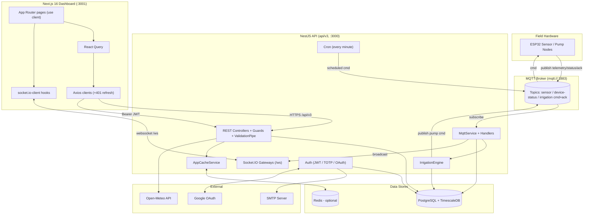
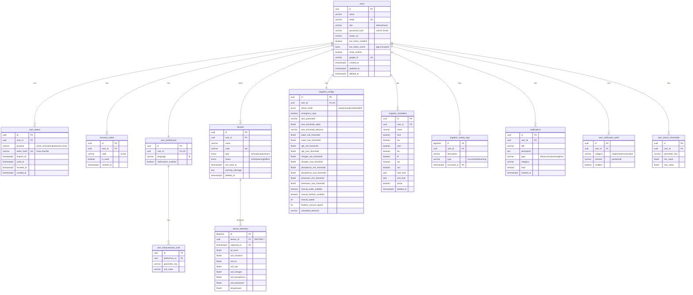

# Hanjeli SmartFarm — System Design & Architecture

> **Purpose:** Zero‑blind‑spot technical reference for the Hanjeli SmartFarm platform (backend `hanjeli-be`, NestJS 11 + frontend `hanjeli-fe`, Next.js 16) to support rigorous end‑to‑end testing.
> **Companion documents:** product requirements (personas, end‑to‑end flows, edge cases, acceptance criteria) live in **PRD.md**; concrete, ID'd test cases in **Test_Case_Catalog.md**.
> **API base path:** all REST endpoints are served under **`/api/v3`** (the bare `GET /` is excluded from the prefix). Swagger at `/api/v3/docs`.
> **Method:** generated by direct source‑code inspection. Where the in‑repo `.md` docs (AGENTS/CLAUDE/DESIGN/db.md) disagree with the code, **the code is authoritative** and the discrepancy is flagged in the Verification Notes below.
> **Generated:** 2026‑06‑14
>
> *Note: product‑level material (personas, end‑to‑end flows, acceptance criteria) lives in **PRD.md**; this document covers the technical design, the testing strategy, and engineering appendices.*

---

## ⚠️ Verification Notes (read before testing)

These are confirmed code‑vs‑doc mismatches and latent bugs found during analysis. They are listed up front because they directly shape the test plan.

| # | Finding | Evidence | Impact on testing |
|---|---------|----------|-------------------|
| V1 | AGENTS.md claims "no real backend is wired yet; data is mocked." **False.** A full Axios + React Query data layer talks to the live NestJS API. | `hanjeli-fe/src/lib/api/*`, `src/hooks/use*Socket.ts` | Test against the real backend, not mocks. |
| V2 | **Two separate Axios clients** coexist with near‑duplicate 401‑refresh logic. `lib/api/client.ts` (named `apiClient`) reads `localStorage` directly; `lib/apiClient.ts` (default export) uses `auth-session` helpers. | `client.ts:9`, `apiClient.ts:72` | Token‑refresh behaviour must be tested through **both** clients. |
| V3 | The scheduled‑irrigation cron publishes to MQTT topic **`hanjeli/${device_code}/irrigation/cmd`**, which does **not** match any topic the ESP32 handler/command path uses (`hanjeli/irrigation/command`). Likely a dead/incorrect topic. | `cron/irrigation.cron.ts:73` vs `config/mqtt.config.ts:42-49` | Schedule‑driven pump start/stop may never reach hardware — explicit test case. |
| V4 | The cron query `JOIN devices d ON d.user_id = s.user_id` yields one row **per device per schedule**; users with multiple devices get duplicate commands/logs. | `cron/irrigation.cron.ts:44-52` | Test multi‑device users for duplicate activity logs. |
| V5 | Profile **email‑change OTP is UI‑only/mocked**: `handleSendEmailToken`/`handleConfirmEmail` just `setTimeout` and gate a local boolean — no backend token is issued or verified. Backend `PUT /users/me` changes the email and flips `email_verified=false` immediately. | `profile/page.tsx:434-459`, `users.service.ts:222-245` | The "confirm email token" step does not actually verify anything. |
| V6 | The whole app is **gated below 1024px** by a maintenance overlay. | `mobile-maintenance-gate.tsx:34-37` | E2E/manual UI tests must run at ≥1024px viewport. |
| V7 | Route protection is **client‑side only**. `middleware.ts` blocks `/dev` in production but does **not** auth‑gate dashboard routes; gating lives in `DashboardLayout` (`useEffect` redirect). | `middleware.ts:16-34`, `dashboard-layout.tsx:56-68` | A direct fetch with no token still hits the page shell; only the API enforces auth. |
| V8 | Auto‑mode irrigation parameter is effectively **hard‑locked to soil moisture**. `updateConfig` overwrites `auto_parameter='soil_moisture'`, `auto_threshold_direction='below'`, `auto_threshold_value=water_min_threshold` on every save, ignoring the DTO. | `irrigation.service.ts:137-139` | Setting `auto_parameter` via API has no lasting effect — verify. |
| V9 | Frontend `lib/api/types.ts` declares `User.role: 'admin'|'manager'|'user'`, but the backend roles are **`'Admin' | 'Guest'`**. The type is stale and unused by the live flow (which uses `useCurrentUser`). | `types.ts:27` vs `authenticated-user.interface.ts:1` | Don't trust that type; assert against `Admin`/`Guest`. |
| V10 | `air_humidity` was dropped from telemetry and all CHECK lists; `HumidityIcon`/`notify.humidity` remain as dead infra. Do not reintroduce. | migration 15, AGENTS.md note | Negative test: humidity must not appear in user‑facing sensor displays. |

---

## 2.1 High‑Level Architecture



### Runtime processes & ports
- **Backend:** single Node process, `PORT` (def 3000). Global prefix `api/v3`. Swagger at `/api/v3/docs`. Static avatars at `/uploads/*`. Socket.IO namespace `/ws`.
- **Frontend:** `next dev -p 3001` (dev) / `next start` (prod). Talks to `NEXT_PUBLIC_API_URL` (def `http://localhost:3000/api/v3`) and WS `NEXT_PUBLIC_WS_URL` (def `<origin>/ws`).
- **In‑process subsystems:** TypeORM pool, MQTT client, Socket.IO server, `@nestjs/schedule` cron, throttler, cache. No separate worker/queue service.

---

## 2.2 Frontend Architecture (`hanjeli-fe`)

### 2.2.1 State management flow
- **Server state:** `@tanstack/react-query` (`QueryProvider`, `staleTime 60s`, `refetchOnWindowFocus:false`, `retry:1`). Query keys centralized in `lib/api/query-keys.ts`. Mutations invalidate keys on success.
- **Auth/session state:** plain `localStorage` (`access_token`, `refresh_token`, `token_expires_at`, `user`) + `sessionStorage` (`challenge_token`), managed by `lib/auth-session.ts`. A `window` event `hanjeli:auth-changed` is dispatched on changes. `useCurrentUser` hydrates from stored user then refetches `/users/me`.
- **Notifications:** React Context (`NotificationProvider`) + Sonner + Socket.IO + `localStorage` fallback (`hanjeli_notifications`).
- **i18n:** i18next (default `id`, fallback `id`, detection localStorage→navigator). `I18nProvider` wraps app; pages call `t()`.
- **Local UI state:** `useState`/`useMemo` per page (no Redux/Zustand). Profile page is a single component swapping `activePanel` across ~10 panels.

### 2.2.2 Component routing & middleware
- **App Router**, all `page.tsx` are `"use client"`.
- **Public/auth routes:** `/`, `/login`, `/login/verify-2fa`, `/login/recovery`, `/register`, `/register/verify-email`, `/forgot-password`, `/reset-password`, `/auth/callback`.
- **Dashboard routes** (wrapped by `DashboardLayout`): `/home`, `/monitoring`, `/irrigation`, `/users`, `/profile`. `/dev` is an internal playground.
- **`DashboardLayout`** decides chrome by matching `dashboardRoutes`; renders desktop floating‑glass sidebar + mobile bottom nav; **client‑side guard**: no token → `/login`; non‑admin on `/users` or `/irrigation` → `/home`. Nav items `users` & `irrigation` are admin‑only.
- **`middleware.ts`:** only redirects `/dev/*`→`/` in production; matcher excludes static/_next/metadata. (Auth gating in middleware is commented out / future.)
- **Layout providers order** (`layout.tsx`): `QueryProvider → I18nProvider → NotificationProvider → MobileMaintenanceGate → (Toaster + DashboardLayout)`.
- **SEO:** `metadata`/`viewport` in `layout.tsx`; `robots.ts` + `sitemap.ts` present; `lang="id"`.

### 2.2.3 Real‑time data consumption
- **`useSensorSocket`** → connects `getSocketUrl()` with `auth:{token}`, transports `['websocket']`; listens `sensor:realtime` (`RealtimeSensorPayload`), tracks `isConnected`. Used by `/home` and `/monitoring`.
- **`useIrrigationSocket`** → listens `irrigation:status` + `irrigation:emergency`; exposes emitters `setMode`, `triggerEmergencyStop`, `resumeSystem`, `toggleManual`.
- **`NotificationProvider`** → its own socket for `notification:new`.
- **Payload handling:** home merges REST overview + live socket values into 5 fixed sensor cards; monitoring patches the recharts trend with the live point and merges live overview.
- **Three independent sockets** are opened (sensor, irrigation, notification) — all to `/ws`, all auth'd by access token. (Optimization opportunity, not a bug.)

### 2.2.4 API client layer
- Two Axios instances (V2). Both: base `NEXT_PUBLIC_API_URL/_BASE_URL`, `withCredentials:true`, request interceptor injects `Bearer`, response interceptor **unwraps `response.data`** and performs single‑shot refresh on `401`.
- Service modules under `lib/api/*` (`auth, sensors, irrigation, devices, users, preferences, weather`) wrap endpoints and tolerate both `{data:…}` and bare responses (`res.data ? res.data : res`).

---

## 2.3 Backend Architecture (`hanjeli-be`)

### 2.3.1 Service structure & patterns
- **Modular NestJS**: feature modules (`auth, users, devices, sensors, irrigation, mqtt, websocket, notifications, preferences, weather, cron`) + `common` (guards, decorators, filters, interceptors, cache, presenters, dto) + global `AppCacheModule`.
- **Patterns:** Controller→Service→Repository (TypeORM); DTO validation via `class-validator`/`class-transformer`; **global `ValidationPipe`** (`whitelist`, `forbidNonWhitelisted`, `transform`, implicit conversion, custom field‑level error factory); **global `HttpExceptionFilter`** (uniform envelope); presenter (`toPublicUser`) to strip sensitive fields; metadata‑driven caching via custom decorators + interceptor; `forwardRef` to resolve circular deps (mqtt↔irrigation↔websocket).
- **Cross‑module realtime:** MQTT handlers call `IrrigationEngine` and the gateways directly (injected), so a single telemetry message can persist, automate, and broadcast.
- **Bootstrap** (`main.ts`): helmet (CSP off in dev), CORS allow‑list (localhost:3000/3001 + configured origins, credentials), global prefix `api/v3` (root `/` excluded), Swagger bearer auth, static `/uploads`.

### 2.3.2 Authentication & security implementation
- **JWT:** three token classes via distinct secrets — access (`JWT_ACCESS_SECRET`, def 15m), refresh (`JWT_REFRESH_SECRET`, def 7d), 2FA challenge (`JWT_CHALLENGE_SECRET`, def 10m). Payload `{sub,email,role,type}`. Secrets resolved by `getAuthSecret` (direct env, else HMAC‑derived from `ENCRYPTION_KEY`; throws if only placeholder). `JwtStrategy` validates access tokens and re‑loads the user (`validateAccessTokenPayload` rejects non‑access types).
- **Guards:** `JwtAuthGuard` (passport‑jwt, custom 401 message), `RolesGuard` (reads `@Roles()` metadata; `403` if role mismatch). `ThrottlerGuard` is the global `APP_GUARD`.
- **Bcrypt:** passwords & recovery codes hashed with `bcryptjs`, rounds = `BCRYPT_ROUNDS` (def 12). Login/compare and current‑password checks use `bcrypt.compare`.
- **TOTP 2FA:** `otplib` `generateSecret`/`generateURI`/`verify`. Secret stored **encrypted at rest as `bytea`** via PostgreSQL `pgp_sym_encrypt`/`pgp_sym_decrypt` with `TWO_FACTOR_ENCRYPTION_SECRET` (pgcrypto). 8 recovery codes (`XXXX‑XXXX`), bcrypt‑hashed, single‑use.
- **Email tokens (`auth_tokens`):** 32‑byte random, stored as **HMAC‑SHA256 hash** (`AUTH_TOKEN_HASH_SECRET`); `purpose` ∈ `email_verification|password_reset`; fields `used_at`/`revoked_at`/`expires_at`; old active tokens revoked on new issue and on password reset/logout.
- **Rate limiting:** global 10 req/60s; per‑route `@Throttle` overrides on auth (register/login 5, refresh 30, forgot/resend 3, etc.).
- **Route protection map:** Auth routes public except `2fa/setup`, `2fa/enable`, `2fa` (DELETE), `logout` (Jwt). Users/Devices/Sensors/Irrigation/Notifications/Preferences/Weather → `JwtAuthGuard`; Users admin routes + Weather add `RolesGuard` (Weather has the guard but **no `@Roles`**, so any authed user passes).
- **WebSocket auth:** `WebsocketAuthService.authenticate` extracts token from `handshake.auth.token`/query/Authorization header, verifies with `JWT_ACCESS_SECRET`, loads user, joins room `user:<id>`; invalid → `auth:error` + disconnect.
- **Other:** CORS credentials, helmet, input whitelisting; SMTP missing config → `503` on email send. Note WS gateways use `cors.origin:'*'` (broad) — security review item.

---

## 2.4 Database Schema (ERD)

PostgreSQL + TimescaleDB. UUID PKs (pgcrypto `gen_random_uuid`) for relational tables; **BIGSERIAL composite PKs** for the two hypertables. Soft delete (`deleted_at`) on `users`, `devices`, `irrigation_schedules`. All FKs `ON DELETE CASCADE` except `sensor_telemetry.device_id` = **RESTRICT**.



### Tables (columns, types, keys)

**users** — `id uuid PK`; `name varchar(100)`; `email varchar(255) UNIQUE` (`idx_users_email`); `role varchar(20) default 'Guest'` CHECK `Admin|Guest`; `password_hash varchar(255) null`; `avatar_url varchar(500) null`; `two_factor_enabled bool`; `two_factor_secret bytea null`; `email_verified bool`; `google_id varchar(255) UNIQUE null` (`idx_users_google_id`); `created_at/updated_at/deleted_at timestamptz`.

**auth_tokens** — `id uuid PK`; `user_id uuid FK→users CASCADE`; `purpose varchar(30)`; `token_hash varchar(128) UNIQUE`; `expires_at`; `used_at null`; `revoked_at null`; `created_at`. Indexes: `idx_auth_tokens_user_id`, `idx_auth_tokens_token_hash (unique)`, `idx_auth_tokens_purpose_hash`, `idx_auth_tokens_expires_at`.

**recovery_codes** — `id uuid PK`; `user_id uuid FK CASCADE` (`idx_recovery_codes_user_id`); `code varchar(255)` (bcrypt); `is_used bool`; `created_at`.

**user_preferences** — `id uuid PK`; `user_id uuid FK,UNIQUE CASCADE`; `language varchar(5) default 'id'`; `notifications_enabled bool default true`; timestamps.

**user_measurement_units** — `id uuid PK`; `preference_id uuid FK→user_preferences CASCADE`; `parameter_key varchar(30)` CHECK `temperature|soil_moisture|ph|soil_ec|soil_npk`; `unit_value varchar(20)`; UNIQUE `(preference_id, parameter_key)`; `idx_user_measurement_units_pref_id`.

**user_notification_prefs** — `id uuid PK`; `user_id FK CASCADE`; `category varchar(30)` CHECK `irrigation|sensor|system`; `channel varchar(10)` CHECK `push|email`; `enabled bool default true`; UNIQUE `(user_id, category, channel)`; `idx_user_notification_prefs_user_id`.

**user_sensor_thresholds** — `id uuid PK`; `user_id FK CASCADE`; `parameter_key varchar(30)` CHECK `temperature|soil_moisture|ph|soil_npk`; `min_value float8`; `max_value float8`; CHECK `min_value < max_value`; UNIQUE `(user_id, parameter_key)`; `idx_user_sensor_thresholds_user_id`.

**devices** — `id uuid PK`; `user_id FK CASCADE` (`idx_devices_user_id`, partial `idx_devices_active WHERE deleted_at IS NULL`); `name varchar(200)`; `code varchar(20) UNIQUE` (`idx_devices_code`); `type device_type ENUM (sensor|pump|camera)`; `status device_status ENUM (online|warning|offline) default offline`; `last_seen_at null`; `warning_message text null`; timestamps + `deleted_at`.

**sensor_telemetry** (HYPERTABLE, partition `captured_at`) — `id bigserial`; composite PK `(id, captured_at)`; `device_id uuid FK→devices RESTRICT`; `captured_at timestamptz default now()`; `ph_level/soil_moisture/soil_ec/soil_npk/soil_nitrogen/soil_phosphorus/soil_potassium/temperature float8 null`. CHECKs: pH 0–14, moisture 0–100, EC/NPK/N/P/K ≥0, temp −50…80. Index `idx_sensor_telemetry_device_time (device_id, captured_at DESC)`. **Compression** segmentby `device_id` after 30d; **retention** drop after 365d.

**irrigation_configs** (1:1 user) — see ERD; ENUMs `irrigation_mode`, `threshold_direction`, `scheduled_behavior_type`; CHECKs: `auto_parameter ∈ {soil_moisture,ph,soil_ec,soil_npk,temperature}` (humidity removed in mig.15), `auto_threshold_value ≥0`, water range 0–100 & min<max, npk/N/P/K min<max & ≥0, manual/fertilizer speed 0–100.

**irrigation_schedules** — `id uuid PK`; `user_id FK CASCADE` (`idx_irrigation_schedules_user_id`); `name varchar(100)`; 7 boolean day columns; `start_time/end_time time` (CHECK start<end via migration); `active bool default true`; timestamps + `deleted_at`.

**irrigation_activity_logs** (HYPERTABLE, partition `executed_at`) — `id bigserial`; composite PK `(id, executed_at)`; `user_id FK CASCADE`; `description varchar(300)`; `type varchar(20)` (`success|info|warning`); `executed_at timestamptz default now()`. Index `idx_irrigation_activity_logs_user_time (user_id, executed_at DESC)`.

**notifications** — `id uuid PK`; `user_id FK CASCADE`; `title varchar(200)`; `description text null`; `type varchar(20)` (`info|success|warning|error`); `category varchar(30) default 'general'` CHECK 12 values (`temperature,irrigation,soil,wind,ph,uv,device,security,auth,profile,system,general`); `read bool`; `created_at`. Index `idx_notifications_user_read_time (user_id, read, created_at DESC)`.

### TimescaleDB continuous aggregates (used by `/sensors/trend` & `/stats`)
- **`sensor_hourly_stats`** — `time_bucket('1 hour', captured_at)` per device; avg/max/min of ph, moisture, ec, npk, temp. Used for `range=day`.
- **`sensor_daily_stats`** — `time_bucket('1 day', …)`; same metrics. Used for `range=week|month`.
- `schema_metadata(key,value,updated_at)` tracks `schema_version` (`1.1.0`) and `timescaledb_setup`.

### Enums (PostgreSQL types, migration 1)
`device_type`, `device_status`, `irrigation_mode`, `threshold_direction`, `scheduled_behavior_type`, `notification_type`, `activity_log_type`.

### Domain constants & unit allow‑lists (`common/constants/domain.constants.ts`)
- Measurement unit options: temperature `°C,°F`; soil_moisture `%VWC,m³/m³,%GWC (g/g),kPa,cb`; ph `pH`; soil_ec `dS/m,mS/cm,µS/cm,mmho/cm`; soil_npk `mg/kg,ppm,%`.
- Sensor params (5): `temperature, soil_moisture, ph, soil_ec, soil_npk`. Threshold params (4): `temperature, soil_moisture, ph, soil_npk`.

---

## 2.5 Caching Strategy (Redis)

Two independent cache systems, both with graceful in‑memory fallback when Redis is off (`REDIS_ENABLED=false` by default).

### A) HTTP response cache — `AppCacheService` + `CustomCacheInterceptor`
- **Mechanism:** controller method decorators `@CacheTtl(seconds)` + `@CacheKey(pattern)` cache GETs; `@CacheInvalidate(patterns…)` busts on writes. Interceptor builds key (explicit pattern interpolated with `{userId}`,`{hash}` of URL,`{path}`,`{method}`, else auto `http:<route>:user:<id>:<sha1>`).
- **Store:** Redis (ioredis, lazy connect, `keyPrefix` default `hanjeli`) **and** an in‑memory `Map` write‑through; reads try Redis then memory. Pattern delete uses Redis `SCAN`+glob on memory.
- **TTLs (verified):**

| Endpoint | Key pattern | TTL |
|----------|-------------|-----|
| `GET /users/me` | `user:profile:{userId}` | 300s |
| `GET /users` | `users:list:{hash}` | 120s |
| `GET /devices` | `devices:{userId}` | 60s |
| `GET /devices/:id` | `devices:{userId}:{hash}` | 60s |
| `GET /sensors/latest` | `sensor:latest:{userId}` | 10s |
| `GET /sensors/overview` | `sensor:overview:{userId}` | 10s |
| `GET /sensors/quality-score` | `sensor:quality:{userId}` | 30s |
| `GET /sensors/trend` | `sensor:trend:{userId}:{hash}` | 60s |
| `GET /sensors/stats` | `sensor:stats:{userId}:{hash}` | 60s |
| `GET /sensors/history` | `sensor:history:{userId}:{hash}` | 30s |
| `GET /irrigation/config` | `irrigation:config:{userId}` | 10s |
| `GET /irrigation/schedules` | `irrigation:schedules:{userId}` | 60s |
| `GET /irrigation/activity` | `irrigation:activity:{userId}:{hash}` | 30s |
| `GET /notifications` | `notifications:{userId}:{hash}` | 30s |
| `GET /preferences` | `preferences:{userId}` | 300s |
| `GET /weather/current` | `weather:current` (global) | 900s |

- **Invalidation map:** profile writes bust `user:profile:{userId}` + `users:list:*`; device writes bust `devices:{userId}` + `devices:{userId}:*`; irrigation config/schedule/activity busted on writes and by MQTT handlers; **MQTT telemetry busts** `sensor:*:{userId}` + `devices:{userId}*` (`mqtt-sensor.handler.ts:229-240`); notifications writes bust `notifications:{userId}:*`.

### B) Weather cache — dedicated Redis client in `WeatherService`
- Separate ioredis client (enabled when `WEATHER_CACHE_DRIVER=redis` or `REDIS_URL` set), key `hanjeli:weather:current`, TTL `WEATHER_CACHE_TTL_SECONDS` (def 900). In‑memory fallback `Map`. On Open‑Meteo failure returns fallback without caching.

> The weather HTTP route ALSO has `@CacheTtl(900)` (layer A) on top of the service cache (layer B) — double caching of the same data.

---

## 2.6 Real‑Time Communication

### 2.6.1 WebSockets (Socket.IO, namespace `/ws`)

**Connection lifecycle:** client connects to `getSocketUrl()` (`NEXT_PUBLIC_WS_URL`, def `<api-origin>/ws`) with `auth:{token}` (access JWT), `transports:['websocket']`. On connect, `WebsocketAuthService.authenticate` verifies the JWT, attaches `client.data.user`, and **joins room `user:<userId>`**. All broadcasts target that per‑user room. Invalid token → `auth:error` then disconnect. Two gateways share the namespace: `SensorGateway` (+notifications) and `IrrigationGateway`.

**Server → Client events**

| Event | Emitted by | Payload |
|-------|-----------|---------|
| `sensor:realtime` | `SensorGateway.broadcastTelemetry` (on telemetry insert) | `{device_code, ph, moisture, ec, npk, nitrogen, phosphorus, potassium, temp, ts}` |
| `device:status` | `SensorGateway.broadcastDeviceStatus` (MQTT status) | `{code, status:'online'|'warning'|'offline', lastSeen:ISO}` |
| `notification:new` | `SensorGateway.broadcastNotification` | notification object `{title, description?, type, category?, ...}` |
| `irrigation:status` | `IrrigationGateway` (after any mode/manual change) | `{mode, emergency, speed, fertilizer_speed, manual_water_enabled, manual_fertilizer_enabled}` |
| `irrigation:emergency` | `IrrigationGateway` (stop/resume) | `{active:boolean, ts}` |
| `irrigation:ack` | `IrrigationGateway.broadcastIrrigationAck` (MQTT ACK) | `{device_code, ...ackPayload, matched_request, timestamp}` |
| `auth:error` | `WebsocketAuthService` | `{message}` then disconnect |

**Client → Server events** (`IrrigationGateway`, all require authenticated socket)

| Event | Payload | Effect |
|-------|---------|--------|
| `irrigation:setMode` | `{mode:'auto'|'manual'|'scheduled'|'off', config?, deviceCode?}` | persist config, publish pump cmds, broadcast status; returns `{success, config}` |
| `irrigation:manualToggle` | `{active, channel?:'water'|'fertilizer', speed?, deviceCode?}` | mutual‑exclusive pump toggle, publish cmd, log, broadcast |
| `irrigation:emergencyStop` | — | `emergency_stop=true`, EMERGENCY_STOP both channels, emit emergency+status |
| `irrigation:resume` | — | `emergency_stop=false`, RESUME, emit emergency+status |

> WS CORS is `origin:'*'` on both gateways (`sensor.gateway.ts:13`, `irrigation.gateway.ts:34`).

### 2.6.2 MQTT (broker, ESP32 ingestion)

**Connection:** `MqttService` connects to `MQTT_BROKER_URL` (def `mqtt://localhost:1883`) when `MQTT_ENABLED` truthy (or broker URL present). `clean:true`, manual reconnect with exponential backoff (`reconnectInitialMs`→`reconnectMaxMs`). **All publishes & subscribes use QoS 1.** Topic matching supports `+`/`#` wildcards via regex.

**Topic map (`config/mqtt.config.ts`)**

| Direction | Topic | QoS | Handler / publisher | Payload |
|-----------|-------|-----|---------------------|---------|
| ESP32→API | `hanjeli/sensor/+` (primary) | 1 | `MqttSensorHandler.handleSensorData` | sensor JSON (see below) |
| ESP32→API | `hanjeli/+/sensor` (legacy) | 1 | same | same |
| ESP32→API | `hanjeli/device/+/status` | 1 | `handleDeviceStatus` | `{code?, status, ts?, message?}` |
| API→ESP32 | `hanjeli/irrigation/command` | 1 | `publishIrrigationCommand` | command (below) |
| ESP32→API | `hanjeli/irrigation/ack` | 1 | `MqttIrrigationHandler.handleIrrigationAck` | `{request_id?, action, status/success, code/device_code?}` |
| ESP32→API | `hanjeli/+/irrigation/ack` (legacy) | 1 | same | same |
| API→ESP32 | `hanjeli/${device_code}/irrigation/cmd` ⚠️ | 1 | **Cron only** (`irrigation.cron.ts:73`) | `{action:'on'|'off', channel:'water', speed:100}` |

**Sensor ingest payload (accepted aliases):** `code` (or topic segment), `ph|ph_level`, `moisture|soil_moisture`, `ec|soil_ec`, `npk|soil_npk`, `nitrogen|soil_nitrogen|n`, `phosphorus|soil_phosphorus|p`, `potassium|soil_potassium|k`, `temp|temperature`, `ts` (epoch ms). NPK derived = sum(N,P,K) when explicit npk absent and all three present.

**Irrigation command payload (API→ESP32):**
```json
{ "action": "START|STOP|EMERGENCY_STOP|RESUME", "mode": "auto|manual|scheduled|off",
  "channel": "water|fertilizer", "speed": 0-100, "device_code": "WS004",
  "user_id": "uuid", "ts": 1718000000000, "request_id": "uuid" }
```
**ACK correlation:** each command carries a `request_id`; the service holds a pending timer (`MQTT_IRRIGATION_ACK_TIMEOUT_MS`, def 10s). `handleIrrigationAck` resolves it (`resolveIrrigationAck`), logs success/warning, and broadcasts `irrigation:ack`. Unmatched ACKs are logged as "tanpa request aktif".

**Publisher/subscriber map**
- **Subscribers (API):** sensor handler (sensor + legacy sensor + device status); irrigation handler (ack + legacy ack).
- **Publishers (API):** `IrrigationEngine` (auto pump cmds), `IrrigationGateway` (manual/mode/emergency/resume cmds), `IrrigationCronService` (scheduled cmds, divergent topic).

---

## 2.7 API Contracts (REST)

All paths below are relative to **`/api/v3`**. Auth = required header `Authorization: Bearer <access_token>` unless marked *public*. Standard error envelope:
```json
{ "success": false, "statusCode": 400, "message": "Input tidak valid",
  "error": "Bad Request", "fields": [{"field":"email","messages":["..."]}],
  "details": ["email: ..."], "path": "/api/v3/...", "timestamp": "2026-06-14T..." }
```

### 2.7.1 Auth

| Method | Path | Auth | Body / Query | Success | Errors |
|--------|------|------|--------------|---------|--------|
| GET | `/` *(no prefix)* | public | — | `200 "Hello World!"` | — |
| POST | `/auth/register` | public, 5/min | `{name, email, password(8-72)}` | `201 {message, user}` | 400, 409, 429 |
| POST | `/auth/login` | public, 5/min | `{email, password}` | `200` tokens **or** `{requires_2fa, challenge_token, expires_in}` | 400, 401, 429 |
| POST | `/auth/refresh` | public, 30/min | `{refresh_token}` | `200` tokens | 401 |
| POST | `/auth/verify-email` | public, 10/min | `{token}` | `200 {message}` | 400 |
| POST | `/auth/resend-verification` | public, 3/min | `{email}` | `200 {message}` | 400, 404 |
| POST | `/auth/forgot-password` | public, 3/min | `{email}` | `200 {message}` (generic) | 429 |
| POST | `/auth/reset-password` | public, 5/min | `{token, new_password}` | `200 {message}` | 400 |
| POST | `/auth/2fa/setup` | Bearer, 5/min | — | `200 {secret, otpauth_uri}` | 400, 401 |
| POST | `/auth/2fa/enable` | Bearer, 5/min | `{token}` | `200 {message, recovery_codes[]}` | 400, 401 |
| POST | `/auth/verify-2fa` | public, 5/min | `{challenge_token, token}` | `200` tokens | 401 |
| POST | `/auth/verify-recovery` | public, 5/min | `{challenge_token, code}` | `200` tokens | 401 |
| DELETE | `/auth/2fa` | Bearer, 5/min | — | `200 {message}` | 401 |
| POST | `/auth/logout` | Bearer | — | `200 {message}` | 401 |
| GET | `/auth/google` | public | — | 302 → Google | — |
| GET | `/auth/google/callback` | public | (Google) | 302 → FE callback | 401 |

**Token response example (`/auth/login`, `/auth/refresh`, `/auth/verify-2fa`, `/auth/verify-recovery`):**
```json
{ "access_token":"<jwt>", "refresh_token":"<jwt>", "token_type":"Bearer",
  "expires_in":900,
  "user":{ "id":"uuid","name":"...","email":"...","role":"Guest",
           "avatar_url":null,"email_verified":true,"two_factor_enabled":false,"google_id":null } }
```

### 2.7.2 Users (`/users`) — Bearer; admin routes also `RolesGuard`

| Method | Path | Auth | Body/Query | Success | Errors |
|--------|------|------|-----------|---------|--------|
| GET | `/users/me` | Bearer | — | `200` PublicUser (cache 300) | 401 |
| PUT | `/users/me` | Bearer | `{name?, email?, password?, currentPassword?, avatar_url?}` | `200` PublicUser | 400,401,409 |
| POST | `/users/me/avatar` | Bearer | multipart `file` (≤2MB, png/jpg/webp/gif) | `200` PublicUser | 400,401 |
| DELETE | `/users/me` | Bearer | `{password?, twoFactorToken?}` | `200 {message}` | 401 |
| GET | `/users` | Admin | `?page&limit&q&role` | `200 {data[], meta}` (cache 120) | 401,403 |
| POST | `/users` | Admin | `{name,email,password,role?}` | `201` PublicUser | 400,403,409 |
| PUT | `/users/:id` | Admin | `{name?,email?,password?,role?}` (UUID param) | `200` PublicUser | 400,403,404 |
| DELETE | `/users/:id` | Admin | UUID param | `200 {message}` | 403,404 |

**PublicUser:** `{id,name,email,role,avatar_url,email_verified,two_factor_enabled,google_id,created_at,updated_at,deleted_at?}`. **Paginated meta:** `{page,limit,total,total_pages}`.

### 2.7.3 Devices (`/devices`) — Bearer

| Method | Path | Body | Success | Errors |
|--------|------|------|---------|--------|
| GET | `/devices` | — | `200 Device[]` (cache 60) | 401 |
| GET | `/devices/:id` | UUID | `200 Device` (cache 60) | 401,404 |
| POST | `/devices` | `{name, code, type:sensor|pump|camera, status?, warning_message?}` | `201 Device` | 400,409 |
| PUT | `/devices/:id` | partial of create | `200 Device` | 400,404,409 |
| DELETE | `/devices/:id` | UUID | `200 {message}` | 404,409 (has telemetry) |

### 2.7.4 Sensors (`/sensors`) — Bearer

| Method | Path | Query | Success |
|--------|------|-------|---------|
| GET | `/sensors/latest` | — | `200 SensorReading[]` (per device, cache 10) |
| GET | `/sensors/overview` | — | `200 {…reading, parameters:[{key,label,value,unit,status[,n/p/k]}]}` or `null` (cache 10) |
| GET | `/sensors/quality-score` | — | `200 {score,status,reasons[],captured_at,device}` (cache 30) |
| GET | `/sensors/trend` | `param,range,device_id?` | `200 [{label:ISO, value}]` (cache 60) |
| GET | `/sensors/stats` | `param,range,device_id?` | `200 {param,range,min,max,avg,sample_count}` (cache 60) |
| GET | `/sensors/history` | `page,limit,from?,to?,device_id?` | `200 {data:SensorTelemetry[], meta}` (cache 30); `400` if from>to |
| GET | `/sensors/export` | `from?,to?,device_id?` | `200` CSV stream (`text/csv`, `sensor_history.csv`) |

`param ∈ {ph,ph_level,soil_moisture,soil_ec,soil_npk,temperature}`, `range ∈ {day,week,month}`. CSV header: `timestamp,device_id,device_code,device_name,ph_level,soil_moisture,soil_ec,soil_npk,soil_nitrogen,soil_phosphorus,soil_potassium,temperature`.

### 2.7.5 Irrigation (`/irrigation`) — Bearer

| Method | Path | Body/Query | Success | Errors |
|--------|------|-----------|---------|--------|
| GET | `/irrigation/config` | — | `200 IrrigationConfig` (auto‑creates, cache 10) | 401 |
| PUT | `/irrigation/config` | `UpdateIrrigationConfigDto` (all optional) | `200 IrrigationConfig` | 400 |
| GET | `/irrigation/schedules` | — | `200 IrrigationSchedule[]` (cache 60) | 401 |
| POST | `/irrigation/schedules` | `{name,mon..sun(bool),start_time"HH:mm:ss",end_time,active?}` | `201 IrrigationSchedule` | 400 |
| PUT | `/irrigation/schedules/:id` | partial | `200` | 400,404 |
| DELETE | `/irrigation/schedules/:id` | UUID | `200 {message}` | 404 |
| GET | `/irrigation/activity` | `page,limit` | `200 {data[], meta}` (cache 30) | 401 |

`UpdateIrrigationConfigDto` fields: `active_mode`, `emergency_stop`, `auto_parameter`, `auto_threshold_value(≥0)`, `auto_threshold_direction`, `water_min/max_threshold(0-100)`, `npk_min/max_threshold(≥0)`, `nitrogen/phosphorus/potassium_min/max_threshold(≥0)`, `manual_water_enabled`, `manual_fertilizer_enabled`, `manual_speed(0-100 int)`, `fertilizer_manual_speed(0-100 int)`, `scheduled_behavior(manual|auto)`. Validation: water min<max, each nutrient min<max, manual water+fertilizer not both on → `400`. (See V8 for forced auto fields.)

### 2.7.6 Notifications (`/notifications`) — Bearer

| Method | Path | Query | Success |
|--------|------|-------|---------|
| GET | `/notifications` | `page,limit,read?('true'|'false')` | `200 {data[], meta}` (cache 30) |
| PATCH | `/notifications/read-all` | — | `200 {message, updated}` |
| PATCH | `/notifications/:id/read` | UUID | `200 Notification` (404 if not owned) |
| DELETE | `/notifications` | — | `200 {message, deleted}` |
| DELETE | `/notifications/:id` | UUID | `200 {message}` (404) |

### 2.7.7 Preferences (`/preferences`) — Bearer

| Method | Path | Body | Success | Errors |
|--------|------|------|---------|--------|
| GET | `/preferences` | — | `200 {preference, units[], notification_prefs[], sensor_thresholds[]}` (seeds defaults, cache 300) | 401 |
| PUT | `/preferences` | `{language?:'id'|'en', notifications_enabled?}` | `200 UserPreference` | 400 |
| PUT | `/preferences/units` | `{parameter_key, unit_value}` | `200 UserMeasurementUnit` | 400 (bad unit) |
| PUT | `/preferences/notification-prefs` | `{category, channel, enabled}` | `200 UserNotificationPref` | 400 |
| PUT | `/preferences/sensor-thresholds` | `{parameter_key, min_value, max_value}` | `200 UserSensorThreshold` | 400 (min≥max) |

> FE note: `preferencesApi.updateSensorThresholds` sends an **array**, but the API expects a **single object**. Mismatch — verify (`preferences.ts:10`).

### 2.7.8 Weather (`/weather`) — Bearer + RolesGuard (no role required)

| Method | Path | Success |
|--------|------|---------|
| GET | `/weather/current` | `200 {temp, temperature, weather_code, condition, icon, observed_at, latitude, longitude, cached, source:'open-meteo'|'fallback'}` (cache 900) |

### 2.7.9 Response code summary
- **200/201** success; **400** validation/business rule; **401** missing/invalid/expired token, bad credentials, unverified email, bad 2FA/recovery; **403** role denied / self‑delete via admin route; **404** resource not owned/missing; **409** duplicate email/device code, delete device with telemetry; **429** throttled; **500** unexpected (logged, generic message); **503** SMTP not configured.

---

## 2.8 Deployment & Infrastructure Logic

- **Background jobs:** `@nestjs/schedule` `ScheduleModule.forRoot()` in `CronModule`; `IrrigationCronService.handleCron` runs **every minute** for scheduled irrigation (V3/V4 caveats). No external job queue.
- **Migrations & seed (scripts in `hanjeli-be/package.json`):** `migration:run` (build then `typeorm migration:run -d dist/config/data-source.js`), `migration:revert`, `migration:show`, `seed:run`, `db:setup` (= run migrations + seed). Migrations live in `dist/migrations/*.js`; `synchronize:false`. 19 migrations (enums → tables → indexes → TimescaleDB → batch‑1 normalization → auth_tokens → threshold ranges → NPK components → defaults‑off).
- **Build/run:** backend `nest build` → `node dist/main` (`start:prod`). Frontend `next build`/`next start`. No Dockerfile/compose, systemd unit, nginx vhost, CI, or `.github` config found in either repo (deployment is manual; tunneling via ngrok/Cloudflare documented in `.env.example`). Frontend `next.config` reportedly **ignores TS + ESLint errors at build** (memory note `hanjeli_build_ignores_errors`) — type‑check separately with `npx tsc --noEmit`.
- **Static assets:** avatars written to `hanjeli-be/uploads/avatars/`, served at `/uploads/*` (absolute URLs built from `PUBLIC_BACKEND_URL`).
- **Config (env):** DB (`DB_HOST/PORT/USERNAME/PASSWORD/NAME/POOL_MAX/LOGGING`), security (`ENCRYPTION_KEY`,`BCRYPT_ROUNDS`), JWT (`JWT_*`,`TWO_FACTOR_ENCRYPTION_SECRET`,`AUTH_TOKEN_HASH_SECRET`,`AUTH_*_EXPIRES_IN`), Google OAuth, SMTP, Redis, Weather (`WEATHER_*`), MQTT (`MQTT_*`), `FRONTEND_*`. Frontend: `NEXT_PUBLIC_API_URL/_BASE_URL/_WS_URL`, `NEXT_PUBLIC_APP_*`.
- **Default ports:** API `3000`, FE dev `3001`, Postgres `5433` (example), Redis `6379`, MQTT `1883`.


# Comprehensive Testing Strategy

> The repo already ships Jest specs (`*.spec.ts`) for: auth service, app‑cache service, jwt/roles guards, cache interceptor, devices/sensors/preferences/notifications services, irrigation engine + service, mqtt service + sensor/irrigation handlers, irrigation gateway. Use these as the baseline and extend per below. Frontend has no test harness configured — add one (Playwright recommended for E2E).

## 3.1 Unit tests

**Auth/security**
- `getAuthSecret` (direct env, HMAC‑derive from `ENCRYPTION_KEY`, throw on placeholder); `parseDurationToSeconds` (`s/m/h/d`, invalid→0); `getBcryptRounds`.
- TOTP encrypt/decrypt round‑trip (mock `pgp_sym_*`); recovery code generation format/uniqueness; `assertValidTotp` valid/invalid.
- HMAC token hashing determinism; token usable/expired/used/revoked branches.
**Irrigation engine** (critical) — moisture hysteresis (`<min`,`>max`,in‑range keeps state); NPK status `missing/low/normal/high`; fertilizer priority suppressing water; emergency forced‑off; state‑change dedupe; ACK‑timeout logging.
**Sensors service** — `sensorStatus` ranges; `penalty`/quality score banding; `toRoundedNumber`/`toIsoString`/CSV escaping; range/aggregate selection (`day`→hourly, `week/month`→daily); `assertDateRange`.
**Cache** — key build/interpolation; glob→regex; TTL≤0 no‑op; memory fallback when Redis null.
**MQTT** — `topicMatches` (`+`/`#`); `parsePayload` malformed→null; sensor normalization aliases + NPK sum; `resolveIrrigationAck`.
**Validation/DTO** — each DTO's class‑validator rules (lengths, enums, ranges, time regex).
**Filter** — `HttpExceptionFilter` envelope for string/array/object/validation/500.

## 3.2 Integration tests (service ↔ DB)

- **Migrations** apply cleanly on a fresh Postgres+TimescaleDB; hypertables, continuous aggregates, compression/retention policies, and all CHECK/UNIQUE constraints exist. Verify `air_humidity` is absent (V10).
- **CHECK enforcement:** insert out‑of‑range telemetry → rejected; threshold min≥max → rejected; manual water+fertilizer both true via API → `400`.
- **Cascades:** deleting a user cascades to auth_tokens, recovery_codes, preferences (+units), devices (blocked by telemetry RESTRICT), configs, schedules, activity logs, notifications, notif prefs, thresholds. Confirm telemetry RESTRICT blocks device delete.
- **Preferences lazy seeding:** first `GET /preferences` creates exactly 5 units + 6 notif prefs + 4 thresholds; idempotent on second call.
- **Auto‑create irrigation config** on first `GET /irrigation/config`.
- **Soft delete + uniqueness:** re‑registering a soft‑deleted email → `409`; reusing a soft‑deleted device code → `409`.
- **Pagination/search** on users & history (limit cap 100, `q`, role filter, date range).
- **Continuous aggregate refresh:** trend/stats return data after telemetry insert + aggregate refresh.

## 3.3 API tests (HTTP, supertest / Postman)

- **AuthZ matrix:** every protected route → `401` without token; admin routes → `403` for Guest; **irrigation routes accept any authed user** (document V‑finding); Weather route passes any authed user.
- **Full auth journeys:** register→verify→login; login→2FA challenge→verify; login→recovery; forgot→reset; refresh rotation; logout revokes outstanding tokens; Google callback redirect params.
- **Rate limiting:** exceed per‑route throttles → `429` with the configured message.
- **Validation envelope:** malformed bodies return `400` with `fields[]`/`details[]`; unknown extra fields rejected (`forbidNonWhitelisted`).
- **Caching:** repeated GETs within TTL return cached (assert via timing/instrumentation or Redis keys); a write busts the right keys (e.g. update profile → `/users/me` refreshes; new telemetry → `/sensors/overview` refreshes).
- **Avatar upload:** valid image persists + returns absolute URL under `/uploads/`; oversize/non‑image → `400`; verify file served (needs `PUBLIC_BACKEND_URL`).
- **CSV export:** correct header + content type + row escaping.
- **Ownership scoping:** user A cannot read/patch user B's notifications/devices/sensors.

## 3.4 Real‑time / IoT integration tests

**MQTT message parsing & pipeline**
- Publish to `hanjeli/sensor/<CODE>` and legacy `hanjeli/<CODE>/sensor`: telemetry row created, device→online + `last_seen_at`, caches busted, `sensor:realtime` broadcast, engine evaluated.
- Unknown code / missing code / malformed JSON → ignored, no crash, appropriate warn log.
- Alias coverage (`ph` vs `ph_level`, `n/p/k` vs `nitrogen/…`, `temp` vs `temperature`) and NPK auto‑sum.
- Device status topic flips status + message + `device:status` broadcast.
- Irrigation command→ACK correlation: command sets a pending `request_id`; matching ACK resolves it + logs success + `irrigation:ack`; **ACK timeout** (10s) logs warning; unmatched ACK logged as "tanpa request aktif".
- **V3 regression:** assert the cron's `hanjeli/${code}/irrigation/cmd` topic vs the ESP32's expected command topic; decide intended behaviour.

**WebSocket stability**
- Connect with valid token → joins `user:<id>`, receives only own‑user broadcasts; no token / bad token → `auth:error` + disconnect.
- Reconnect after drop re‑authenticates and resumes events.
- `irrigation:setMode`/`manualToggle`/`emergencyStop`/`resume` persist config, publish correct MQTT commands, and broadcast `irrigation:status`/`irrigation:emergency`.
- Manual mutual exclusivity (enabling fertilizer disables water and vice‑versa) over WS.
- Multiple concurrent clients for the same user all receive broadcasts; cross‑user isolation holds.

## 3.5 Auth session persistence (E2E)

- Access token expiry → first 401 triggers silent refresh via `/auth/refresh`; request retried transparently (test **both** Axios clients, V2).
- Refresh token invalid/expired → session cleared + redirect to `/login` (except on auth pages).
- `hanjeli:auth-changed` event updates `useCurrentUser` consumers (header avatar/name) without reload.
- Reload restores session from `localStorage`; logout clears tokens+user and redirects.
- 2FA challenge token survives navigation to `/login/verify-2fa` (sessionStorage) and is cleared after success.

## 3.6 Frontend E2E (Playwright, ≥1024px per V6)

- Registration → verify‑email screen → (deep‑link token) verified → login → `/home`.
- Login with 2FA → OTP screen → success; recovery‑code path.
- Google button navigates to `/api/v3/auth/google` (stub provider).
- Dashboard guard: unauthenticated visit to `/home` redirects to `/login`; Guest visiting `/users` or `/irrigation` redirects to `/home`; admin sees both tabs.
- Home: 5 sensor cards render, NPK shows N/P/K, quality score + donut update on live `sensor:realtime`.
- Monitoring: parameter dropdown + day/week/month toggle refetch trend/stats; history pagination + date filter + export button.
- Irrigation: mode toggles are exclusive; emergency‑stop disables controls + banner; manual water/fertilizer mutual exclusion; schedule add/edit/delete via modal (≥1 day + start<end validation).
- Profile panels: change password (current required), edit profile (note V5 email‑OTP is mocked), enable 2FA (QR→verify→recovery codes copy/download), disable 2FA, units, thresholds, add device, delete account (type‑to‑confirm + password + 2FA).
- Users (admin): create/edit/delete with optimistic update + invalidation; search + role filter + client pagination; cannot delete self.
- i18n: toggle `id`/`en` re‑renders all strings; default is `id`.
- Notifications: `notification:new` raises one (deduped) toast + bell ring + persisted item; mark‑read/clear sync to API.

## 3.7 Non‑functional / negative

- **Resilience:** Redis off → app works (memory cache); MQTT off → REST/WS still work, publishes no‑op; Open‑Meteo down → fallback weather; SMTP unset → `503` on email actions only.
- **Security review items:** WS `cors.origin:'*'`; irrigation endpoints lack `@Roles`; tokens in `localStorage` (XSS surface); ensure no secrets logged; helmet/CSP behaviour (CSP disabled in non‑prod).
- **Performance:** telemetry insert path under load (hypertable + cache invalidation); aggregate query latency for week/month; connection counts (3 sockets/client).
- **Data integrity:** multi‑device user does not get duplicated scheduled commands (V4).

## Appendix A — File → Responsibility index (selected)

| Concern | Backend file | Frontend file |
|--------|--------------|---------------|
| Bootstrap/security | `src/main.ts`, `src/app.module.ts` | `src/app/layout.tsx`, `src/middleware.ts` |
| Auth | `modules/auth/*` | `app/login`, `app/register`, `app/auth/callback`, `app/login/verify-2fa`, `app/login/recovery`, `app/forgot-password`, `app/reset-password`, `lib/api/auth.ts`, `lib/auth-session.ts` |
| Users | `modules/users/*` | `app/users/page.tsx`, `app/profile/page.tsx`, `lib/api/users.ts`, `lib/hooks/useCurrentUser.ts` |
| Devices | `modules/devices/*` | `lib/api/devices.ts`, profile/home device UI |
| Sensors | `modules/sensors/*` | `app/home`, `app/monitoring`, `lib/api/sensors.ts`, `hooks/useSensorSocket.ts` |
| Irrigation | `modules/irrigation/*`, `modules/cron/*` | `app/irrigation/page.tsx`, `lib/api/irrigation.ts`, `hooks/useIrrigationSocket.ts` |
| Realtime | `modules/mqtt/*`, `modules/websocket/*` | socket hooks, `contexts/notification-context.tsx` |
| Cache | `common/cache/*`, `common/interceptors/cache.interceptor.ts`, `config/redis.config.ts` | React Query (`providers/query-provider.tsx`) |
| Weather | `modules/weather/*` | `lib/api/weather.ts` |
| Preferences/Notifications | `modules/preferences/*`, `modules/notifications/*` | `lib/api/preferences.ts`, `contexts/notification-context.tsx` |
| Schema | `entities/*`, `migrations/*`, `database/seed.ts` | `db.md` (doc, treat as non‑authoritative) |

## Appendix C — Test Fixtures & Seed Data (for E2E setup)

Two seeding paths exist; know which one your environment ran.

### C.1 Dev seed via migration 14 (`SeedInitialData`, only when `NODE_ENV != production`)
Creates a ready‑to‑use dataset; migration 15 then **promotes this user to `Admin`**:

- **User:** `dev@hanjeli.id` — name "Hanief Huda", `email_verified=true`, role **Admin** (after mig.15). Password hash is a fixed bcrypt string `$2b$12$LJ3m4ys6Lp8Cfs.GBf3bXeKUQ7ZxY5VzRqF0rN2dH8wSjE6vKmTi` (plaintext unknown — reset via seed script or `SEED_ADMIN_RESET_PASSWORD` if you need to log in as this user).
- **Preferences:** language `id`, notifications on; 5 measurement units (`°C, %VWC, pH, dS/m, mg/kg`); migration 15 also seeds 6 notification prefs + 4 thresholds for this user.
- **Devices (4):** `PMP01` (pump, online), **`WS004`** (sensor, online — the telemetry source), `TH011` (sensor, warning), `CAM01` (camera, offline).
- **Irrigation config:** safe defaults — `active_mode='off'`, water 30–80, N/P/K 20–60, speeds 100, `scheduled_behavior='manual'`.
- **Schedules (2):** "Penyiraman Pagi" mon/wed/fri 06:00–06:30; "Penyiraman Sore" tue/thu/sat 17:00–17:30.
- **Telemetry:** 10 rows on `WS004` over the last 10 hours (pH ~6.5–7.3, moisture ~55–75%, EC ~0.8–1.4, N/P/K randomized, temp ~20–28).
- **Notifications (3):** device warning (TH011), irrigation success, soil moisture warning.

### C.2 Admin seed via `database/seed.ts` (`npm run seed:run` / `db:setup`)
- Creates/updates an **Admin** from `SEED_ADMIN_EMAIL` (def `admin@hanjeli.local`), `SEED_ADMIN_NAME`, `SEED_ADMIN_PASSWORD` (**must be a strong, non‑placeholder password ≥8 chars or the script throws**). `SEED_ADMIN_RESET_PASSWORD=true` re‑hashes the password on an existing admin.
- Also seeds that admin's default preferences, units, notification prefs, thresholds, and an `off` irrigation config. Clears the admin's recovery codes.

### C.3 Recommended additional fixtures to create for testing
- A **Guest** user (register + verify) to test role‑denied paths (`/users` admin routes → `403`) and the FE tab‑hiding.
- A second user with **2FA enabled** (run Flow D) to test challenge/recovery and 2FA‑gated account deletion.
- A device with **zero telemetry** (to test successful delete) vs one **with telemetry** (delete → `409`).
- An MQTT publisher/simulator that can emit to `hanjeli/sensor/WS004` and respond on `hanjeli/irrigation/ack` with a matching `request_id` (and one that deliberately withholds the ACK to exercise the 10s timeout path).

### DB‑level CHECK/constraint confirmations (verified in migrations)
- `users`: `uq_users_email`, `uq_users_google_id`, partial `idx_users_active`; `chk_users_role` (mig.15). pgcrypto extension enabled in mig.2.
- `auth_tokens`: `chk_auth_tokens_purpose ∈ {email_verification, password_reset}`, unique `token_hash`, partial active index.
- `irrigation_schedules`: `chk_time_range CHECK (start_time < end_time)` at the DB level (in addition to service validation).
- `irrigation_configs`: range CHECKs added in mig.8 then re‑asserted in mig.17 (water 0–100 & min<max; npk/N/P/K ≥0 & min<max; speeds 0–100). Safe‑by‑default (`active_mode='off'`) since mig.19.
- `sensor_telemetry`: N/P/K columns + `≥0` CHECKs added in mig.18; back‑fill split legacy `soil_npk` into thirds.


---

*End of document.*
