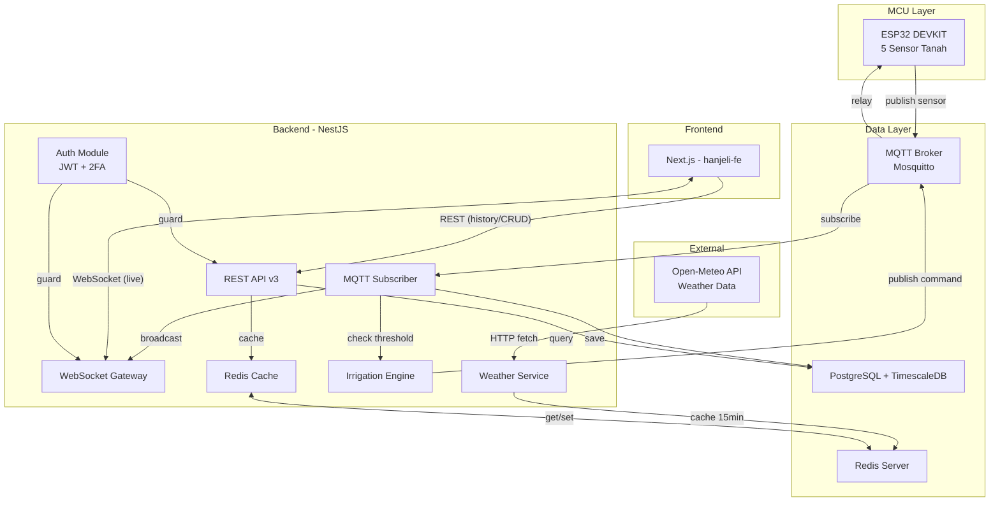
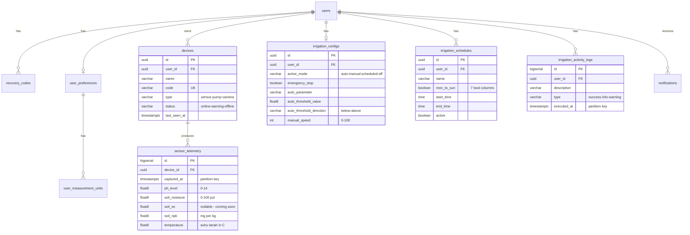

# 🏗️ Hanjeli Smart Farm — Backend Implementation Design Plan

> **Framework:** NestJS | **DB:** PostgreSQL + TimescaleDB | **Cache:** Redis | **Real-time:** WebSocket | **IoT:** MQTT
> **Status:** DESIGN ONLY — belum implementasi

---

## 📋 Daftar Isi

1. [Analisis Frontend](#1-analisis-frontend)
2. [Arsitektur Sistem](#2-arsitektur-sistem)
3. [Desain Database](#3-desain-database)
4. [Desain MQTT](#4-desain-mqtt)
5. [Desain WebSocket](#5-desain-websocket)
6. [Desain REST API v3](#6-desain-rest-api-v3)
7. [Redis Cache Strategy](#7-redis-cache-strategy)
8. [NestJS Module Structure](#8-nestjs-module-structure)
9. [Urutan Implementasi](#9-urutan-implementasi)

---

## 1. Analisis Frontend

### Sensor ESP32 (5 Sensor Tanah)

| # | Parameter | Key | Unit | Status | Sumber |
|---|-----------|-----|------|--------|--------|
| 1 | pH Tanah | `ph_level` | pH | ✅ Active | ESP32 Sensor |
| 2 | Kelembaban Tanah | `soil_moisture` | % | ✅ Active | ESP32 Sensor |
| 3 | Suhu Tanah | `temperature` | °C | ✅ Active | ESP32 Sensor |
| 4 | Kadar NPK | `soil_npk` | mg/kg | ✅ Active | ESP32 Sensor |
| 5 | EC Tanah | `soil_ec` | mS/cm | ❌ Coming Soon | ESP32 (future) |

> [!IMPORTANT]
> **Suhu = Suhu Tanah** (bukan suhu udara). Kolom `air_humidity` di entity `sensor_telemetry` **akan dihapus** karena tidak ada sensor udara dari ESP32.

### Cuaca — External Weather API

Data cuaca pada badge Home page (`24°C, Cerah`) bukan dari sensor ESP32, melainkan dari **Weather API eksternal gratis**.

| Data | Contoh | Ditampilkan Di |
|------|--------|----------------|
| Suhu Udara | `24°C` | Home hero badge |
| Kondisi Cuaca | `Cerah` / `Berawan` | Home hero badge |

**API yang digunakan: [Open-Meteo](https://open-meteo.com/)**

| Kriteria | Open-Meteo |
|----------|------------|
| Gratis | ✅ 100% gratis, tanpa batas request |
| API Key | ❌ Tidak perlu API key |
| Atribusi wajib | ❌ Tidak diperlukan |
| Akurasi | ✅ Multi-model (ECMWF, GFS, DWD) |
| Lokasi | Custom lat/lon |

**Koordinat Desa Wisata Hanjeli, Sukabumi:**
```
Latitude:  -6.9271
Longitude: 106.9300
```

**Contoh request:**
```
GET https://api.open-meteo.com/v1/forecast?latitude=-6.9271&longitude=106.93&current=temperature_2m,weather_code&timezone=Asia/Jakarta
```

**Contoh response:**
```json
{
  "current": {
    "temperature_2m": 24.1,
    "weather_code": 0
  }
}
```

**Weather code mapping:**
```typescript
// 0 = Clear → "Cerah"
// 1-3 = Partly cloudy → "Berawan Sebagian"  
// 45-48 = Fog → "Berkabut"
// 51-67 = Rain → "Hujan"
// 71-77 = Snow → "Salju"
// 80-82 = Rain showers → "Hujan Ringan"
// 95-99 = Thunderstorm → "Badai"
```

> [!NOTE]
> Backend akan meng-cache data cuaca di Redis dengan TTL 15 menit (cuaca tidak berubah terlalu cepat). Frontend fetch via `GET /api/v3/weather/current`.

### Halaman & Fitur → Endpoint

| Halaman | Fitur | Backend Endpoint |
|---------|-------|-----------------|
| **Landing** `/` | Static | Tidak perlu API |
| **Login** `/login` | Email/password, Google OAuth, 2FA | `POST /auth/login`, `POST /auth/google`, `POST /auth/verify-2fa` |
| **Register** `/register` | Sign up + email verify | `POST /auth/register`, `POST /auth/verify-email` |
| **Forgot Password** | Reset link via email | `POST /auth/forgot-password`, `POST /auth/reset-password` |
| **Dashboard** `/home` | 5 sensor cards, quality score, donut chart, recent logs, IoT devices, weather badge, notifications | WS `sensor:realtime`, `GET /sensors/latest`, `GET /devices`, `GET /notifications`, `GET /weather/current` |
| **Monitoring** `/monitoring` | Parameter selector, trend graph (day/week/month), summary stats, history table + pagination, export CSV | `GET /sensors/trend`, `GET /sensors/stats`, `GET /sensors/history`, `GET /sensors/export` |
| **Irrigation** `/irrigation` | 3 mode (Auto/Scheduled/Manual), emergency stop, schedule CRUD, threshold config, activity log | WS irrigation events, `GET/PUT /irrigation/config`, CRUD `/irrigation/schedules`, `GET /irrigation/activity` |
| **Profile** `/profile` | Edit profile + avatar, change password, 2FA, language, notification prefs, sensor thresholds, IoT management, measurement units, delete account | `GET/PUT /users/me`, `PUT /users/me/password`, 2FA endpoints, CRUD `/devices`, `PUT /preferences` |
| **Users** `/users` | CRUD, search, filter role, pagination | CRUD `/users` (Admin only) |

---

## 2. Arsitektur Sistem



### Data Flow: Sensor (ESP32 → Frontend)

```
ESP32 --[MQTT]--> Mosquitto --[subscribe]--> NestJS MQTT Module
  → Save to sensor_telemetry (TimescaleDB hypertable)
  → Broadcast via WebSocket 'sensor:realtime'
  → Check threshold → trigger auto irrigation if needed
  → Invalidate Redis cache (sensor:latest, sensor:overview)
```

### Data Flow: Irrigation (Frontend → ESP32)

```
Frontend --[WS emit]--> NestJS WebSocket Gateway
  → Validate + save state to irrigation_configs
  → Publish MQTT command to 'hanjeli/irrigation/command'
  → ESP32 subscribe & execute pump control
  → Log to irrigation_activity_logs
```

### Data Flow: Weather (Open-Meteo → Frontend)

```
Frontend --[REST]--> GET /api/v3/weather/current
  → Check Redis cache (TTL 15min)
  → Cache miss? → Fetch Open-Meteo API
  → Parse weather_code → label ("Cerah", "Berawan", etc.)
  → Cache response → Return to frontend
```

---

## 3. Desain Database

### ERD (10 Tabel: 8 relational + 2 hypertable)



> [!WARNING]
> **Perubahan dari desain sebelumnya:** Kolom `air_humidity` pada `sensor_telemetry` **DIHAPUS** karena bukan data dari ESP32. Cuaca diambil dari Open-Meteo API.

### TimescaleDB Hypertables

| Table | Partition Key | Chunk Interval | Compression | Retention |
|-------|--------------|----------------|-------------|-----------|
| `sensor_telemetry` | `captured_at` | 1 day | After 7 days | 365 days |
| `irrigation_activity_logs` | `executed_at` | 7 days | After 30 days | 180 days |

### Continuous Aggregates

```sql
-- Per jam (untuk trend graph "day")
CREATE MATERIALIZED VIEW sensor_hourly WITH (timescaledb.continuous) AS
SELECT device_id, time_bucket('1 hour', captured_at) AS bucket,
  AVG(ph_level) avg_ph, AVG(soil_moisture) avg_moisture,
  AVG(soil_npk) avg_npk, AVG(temperature) avg_temp,
  MAX(temperature) max_temp, MIN(temperature) min_temp
FROM sensor_telemetry GROUP BY device_id, bucket;

-- Per hari (untuk trend graph "week" & "month")
CREATE MATERIALIZED VIEW sensor_daily WITH (timescaledb.continuous) AS
SELECT device_id, time_bucket('1 day', captured_at) AS bucket,
  AVG(ph_level) avg_ph, MAX(ph_level) max_ph, MIN(ph_level) min_ph,
  AVG(soil_moisture) avg_moisture, MAX(soil_moisture) max_moisture, MIN(soil_moisture) min_moisture,
  AVG(soil_npk) avg_npk, AVG(temperature) avg_temp,
  MAX(temperature) max_temp, MIN(temperature) min_temp
FROM sensor_telemetry GROUP BY device_id, bucket;
```

---

## 4. Desain MQTT

### Topic Structure

| Topic | Direction | Publisher → Subscriber | Payload |
|-------|-----------|----------------------|---------|
| `hanjeli/sensor/{device_code}` | ESP32 → Server | ESP32 → NestJS | Sensor reading |
| `hanjeli/device/{device_code}/status` | ESP32 → Server | ESP32 → NestJS | Heartbeat |
| `hanjeli/irrigation/command` | Server → ESP32 | NestJS → ESP32 | Pump command |
| `hanjeli/irrigation/ack` | ESP32 → Server | ESP32 → NestJS | Command ACK |

### Payload Format

**Sensor Data** (`hanjeli/sensor/#WS004`):
```json
{
  "code": "#WS004",
  "ts": 1717804800000,
  "ph": 6.8,
  "moisture": 42,
  "ec": null,
  "npk": 120,
  "temp": 22.4
}
```

> [!NOTE]
> Tidak ada field `humidity` / `air_humidity` — hanya 5 parameter tanah.

**Irrigation Command** (`hanjeli/irrigation/command`):
```json
{
  "action": "START|STOP|EMERGENCY_STOP|RESUME",
  "mode": "auto|manual|scheduled",
  "speed": 100,
  "ts": 1717804800000,
  "request_id": "uuid-v4"
}
```

**Device Heartbeat** (`hanjeli/device/#WS004/status`):
```json
{
  "code": "#WS004",
  "status": "online",
  "rssi": -45,
  "uptime_ms": 3600000,
  "ts": 1717804800000
}
```

---

## 5. Desain WebSocket

### Namespace: `/ws`

| Event (Server → Client) | Trigger | Payload |
|--------------------------|---------|---------|
| `sensor:realtime` | MQTT data masuk | `{ ph, moisture, ec, npk, temp, ts }` |
| `irrigation:status` | Mode/state change | `{ mode, emergency, speed }` |
| `irrigation:emergency` | E-stop/resume | `{ active: boolean, ts }` |
| `device:status` | Device heartbeat | `{ code, status, lastSeen }` |
| `notification:new` | New notification | `{ id, title, type, category }` |

| Event (Client → Server) | Action | Payload |
|--------------------------|--------|---------|
| `irrigation:setMode` | Change mode | `{ mode, config }` |
| `irrigation:emergencyStop` | E-stop | `{}` |
| `irrigation:resume` | Resume | `{}` |
| `irrigation:manualToggle` | Manual ON/OFF | `{ active: boolean }` |

---

## 6. Desain REST API v3

> Base: `/api/v3` | Auth: Bearer JWT | Pagination: `?page=1&limit=20`

### 6.1 Auth

| Method | Endpoint | Deskripsi |
|--------|----------|-----------|
| `POST` | `/auth/register` | Register user |
| `POST` | `/auth/login` | Login → JWT |
| `POST` | `/auth/google` | Google OAuth |
| `POST` | `/auth/verify-2fa` | Verify TOTP |
| `POST` | `/auth/verify-recovery` | Verify recovery code |
| `POST` | `/auth/forgot-password` | Send reset email |
| `POST` | `/auth/reset-password` | Reset with token |
| `POST` | `/auth/verify-email` | Verify email |
| `POST` | `/auth/resend-verification` | Resend email |
| `POST` | `/auth/refresh` | Refresh JWT |

### 6.2 User/Profile

| Method | Endpoint | Cache |
|--------|----------|-------|
| `GET` | `/users/me` | ✅ 5min |
| `PUT` | `/users/me` | Invalidate |
| `PUT` | `/users/me/password` | ❌ |
| `POST` | `/users/me/2fa/enable` | ❌ |
| `POST` | `/users/me/2fa/verify` | ❌ |
| `DELETE` | `/users/me/2fa` | ❌ |
| `DELETE` | `/users/me` | ❌ |
| `POST` | `/users/me/confirm-email` | ❌ |

### 6.3 Users (Admin)

| Method | Endpoint | Cache |
|--------|----------|-------|
| `GET` | `/users?q=&role=&page=&limit=` | ✅ 2min |
| `POST` | `/users` | Invalidate |
| `PUT` | `/users/:id` | Invalidate |
| `DELETE` | `/users/:id` | Invalidate |

### 6.4 Sensors

| Method | Endpoint | Cache |
|--------|----------|-------|
| `GET` | `/sensors/latest` | ✅ 10s |
| `GET` | `/sensors/overview` | ✅ 10s |
| `GET` | `/sensors/trend?param=ph&range=day` | ✅ 1min |
| `GET` | `/sensors/stats?param=ph&range=day` | ✅ 1min |
| `GET` | `/sensors/history?from=&to=&page=&limit=` | ✅ 30s |
| `GET` | `/sensors/export?from=&to=&format=csv` | ❌ |
| `GET` | `/sensors/quality-score` | ✅ 30s |

### 6.5 Weather (NEW)

| Method | Endpoint | Cache | Deskripsi |
|--------|----------|-------|-----------|
| `GET` | `/weather/current` | ✅ 15min | Fetch dari Open-Meteo API, return `{ temp, condition, icon }` |

### 6.6 Irrigation

| Method | Endpoint | Cache |
|--------|----------|-------|
| `GET` | `/irrigation/config` | ✅ 10s |
| `PUT` | `/irrigation/config` | Invalidate |
| `GET` | `/irrigation/schedules` | ✅ 1min |
| `POST` | `/irrigation/schedules` | Invalidate |
| `PUT` | `/irrigation/schedules/:id` | Invalidate |
| `DELETE` | `/irrigation/schedules/:id` | Invalidate |
| `GET` | `/irrigation/activity?page=&limit=` | ✅ 30s |

### 6.7 Devices

| Method | Endpoint | Cache |
|--------|----------|-------|
| `GET` | `/devices` | ✅ 1min |
| `POST` | `/devices` | Invalidate |
| `PUT` | `/devices/:id` | Invalidate |
| `DELETE` | `/devices/:id` | Invalidate |

### 6.8 Notifications

| Method | Endpoint | Cache |
|--------|----------|-------|
| `GET` | `/notifications?page=&limit=` | ✅ 30s |
| `PATCH` | `/notifications/:id/read` | Invalidate |
| `PATCH` | `/notifications/read-all` | Invalidate |
| `DELETE` | `/notifications` | Invalidate |

### 6.9 Preferences

| Method | Endpoint | Cache |
|--------|----------|-------|
| `GET` | `/preferences` | ✅ 5min |
| `PUT` | `/preferences` | Invalidate |
| `PUT` | `/preferences/units` | Invalidate |
| `PUT` | `/preferences/notification-prefs` | Invalidate |
| `PUT` | `/preferences/sensor-thresholds` | Invalidate |

---

## 7. Redis Cache Strategy

### Key Patterns & TTL

```
hanjeli:sensor:latest:{deviceId}       TTL 10s
hanjeli:sensor:overview:{userId}       TTL 10s
hanjeli:sensor:trend:{param}:{range}   TTL 60s
hanjeli:sensor:stats:{param}:{range}   TTL 60s
hanjeli:sensor:history:{hash}          TTL 30s
hanjeli:weather:current                TTL 900s (15min)
hanjeli:irrigation:config:{userId}     TTL 10s
hanjeli:irrigation:schedules:{userId}  TTL 60s
hanjeli:devices:{userId}               TTL 60s
hanjeli:notifications:{userId}:{page}  TTL 30s
hanjeli:user:profile:{userId}          TTL 300s
hanjeli:users:list:{hash}              TTL 120s
hanjeli:preferences:{userId}           TTL 300s
```

### Invalidation Rules

| Event | Invalidate Keys |
|-------|----------------|
| MQTT sensor data | `sensor:latest:*`, `sensor:overview:*` |
| Irrigation change | `irrigation:config:{userId}` |
| Schedule CRUD | `irrigation:schedules:{userId}` |
| Device CRUD | `devices:{userId}` |
| Notification change | `notifications:{userId}:*` |
| Profile update | `user:profile:{userId}` |

---

## 8. NestJS Module Structure

```
src/
├── main.ts
├── app.module.ts
├── config/
│   ├── data-source.ts          ← existing
│   ├── redis.config.ts
│   └── mqtt.config.ts
├── common/
│   ├── guards/
│   │   ├── jwt-auth.guard.ts
│   │   └── roles.guard.ts
│   ├── decorators/
│   │   ├── current-user.decorator.ts
│   │   └── roles.decorator.ts
│   ├── interceptors/
│   │   └── cache.interceptor.ts
│   └── dto/
│       └── pagination.dto.ts
├── entities/                    ← existing (10 entities)
├── modules/
│   ├── auth/                    # JWT + Google + 2FA
│   ├── users/                   # Profile + Admin CRUD
│   ├── sensors/                 # TimescaleDB queries
│   ├── weather/                 # Open-Meteo proxy + cache
│   ├── irrigation/              # Config + schedules + engine
│   ├── devices/                 # IoT device CRUD
│   ├── notifications/           # CRUD + WebSocket push
│   ├── preferences/             # Units + notif prefs
│   ├── mqtt/                    # MQTT client + handlers
│   └── websocket/               # WS gateway
└── migrations/
```

### Dependencies ✅ (sudah ada di package.json)

`@nestjs/websockets`, `@nestjs/platform-socket.io`, `@nestjs/microservices`, `@nestjs/cache-manager`, `ioredis`, `mqtt`, `@nestjs/typeorm`, `pg`, `@nestjs/config`

---

## 9. Urutan Implementasi

### Phase 1 — Foundation (Week 1)
- Migration: hapus `air_humidity` dari `sensor_telemetry`
- TimescaleDB hypertable + continuous aggregates
- Redis module setup
- Auth module (JWT + Google + 2FA)
- Common guards/decorators

### Phase 2 — Core API (Week 2)
- Users module (profile + admin CRUD)
- Preferences module
- Devices module
- Notifications module
- Sensors module (history, trend, stats, export)
- Irrigation module (config, schedules, activity)
- **Weather module** (Open-Meteo proxy + Redis 15min cache)

### Phase 3 — Real-time (Week 3)
- MQTT module (connect broker, subscribe sensor topics)
- MQTT sensor handler (parse → save → broadcast → threshold check)
- WebSocket gateway (sensor + irrigation events)
- Irrigation engine (auto-mode logic)

### Phase 4 — Polish (Week 4)
- Redis cache on all GET endpoints
- Rate limiting
- Input validation (class-validator)
- Swagger API docs
- E2E testing

---

> [!IMPORTANT]
> **Perubahan kunci dari versi sebelumnya:**
> 1. `air_humidity` **dihapus** dari sensor_telemetry — bukan data ESP32
> 2. `temperature` = **Suhu Tanah** (Soil Temperature), bukan suhu udara
> 3. **Weather module** ditambahkan — fetch dari Open-Meteo API (gratis, tanpa API key, tanpa atribusi wajib)
> 4. Lokasi: **Desa Wisata Hanjeli, Sukabumi** (`-6.9271, 106.93`)
