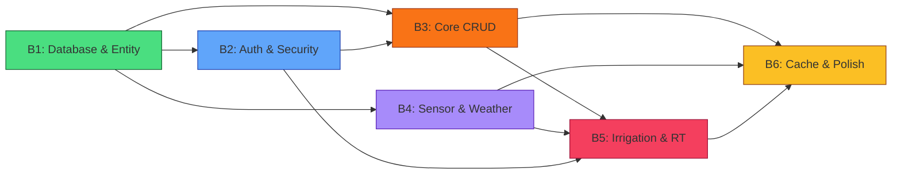

# 📦 Batch Task Breakdown — Hanjeli Smart Farm Backend

> Pembagian pekerjaan per **Batch** dengan **jobdesk per agen** sesuai CLAUDE.md
> Total: **6 Batch** | 12 Tabel BCNF | ~50 Endpoints | 10 NestJS Modules

---

## Ringkasan Batch

| Batch | Nama | Fokus | Estimasi |
|-------|------|-------|----------|
| **B1** | Database & Entity Foundation | Fix entity, 2 entity baru, migration, TimescaleDB | 1–2 hari |
| **B2** | Auth & Security Core | JWT, Google OAuth, 2FA, Guards, Decorators | 1–2 hari |
| **B3** | Core CRUD Modules | Users, Devices, Notifications, Preferences | 2–3 hari |
| **B4** | Sensor & Weather Intelligence | Sensors module, TimescaleDB queries, Weather API | 2–3 hari |
| **B5** | Irrigation & Real-time | Irrigation CRUD, MQTT, WebSocket, Engine | 2–3 hari |
| **B6** | Cache, Polish & Integration | Redis cache, validation, Swagger, testing | 1–2 hari |

---

## Batch 1 — Database & Entity Foundation

> **Tujuan:** Semua 12 entity BCNF-compliant siap, migration berjalan, TimescaleDB hypertable aktif.

### 🟠 Agen 6 (Tech Updater) — Pra-check
- Pastikan versi TypeORM dan TimescaleDB compatible
- Cek best practice `pgcrypto` untuk enkripsi `two_factor_secret`
- Verifikasi `gen_random_uuid()` tersedia di PostgreSQL target

### 🟢 Agen 1 (Fullstack Dev) — Implementasi

| # | Task | File Target | Detail |
|---|------|------------|--------|
| 1.1 | Fix `users.entity.ts` — tambah `role` | `entities/user.entity.ts` | Tambah kolom `role VARCHAR(20) DEFAULT 'Guest'` CHECK `'Admin'\|'Guest'` |
| 1.2 | Fix `sensor-telemetry.entity.ts` | `entities/sensor-telemetry.entity.ts` | Hapus `air_humidity`, fix comment `temperature` → "Suhu Tanah" |
| 1.3 | Fix `irrigation-config.entity.ts` | `entities/irrigation-config.entity.ts` | Hapus `'humidity'` dari CHECK `auto_parameter` |
| 1.4 | Fix `user-measurement-unit.entity.ts` | `entities/user-measurement-unit.entity.ts` | Hapus `'humidity'` dari valid `parameter_key` |
| 1.5 | Buat `user-notification-pref.entity.ts` | `entities/user-notification-pref.entity.ts` | Tabel baru: `(user_id, category, channel, enabled)` UNIQUE composite |
| 1.6 | Buat `user-sensor-threshold.entity.ts` | `entities/user-sensor-threshold.entity.ts` | Tabel baru: `(user_id, parameter_key, min_value, max_value)` CHECK `min < max` |
| 1.7 | Update `entities/index.ts` barrel | `entities/index.ts` | Export 2 entity baru |
| 1.8 | Update `users.entity.ts` relations | `entities/user.entity.ts` | Tambah `@OneToMany` ke 2 entity baru |
| 1.9 | Generate migration | `migrations/` | `npm run migration:generate -- src/migrations/AddRoleAndNewTables` |
| 1.10 | TimescaleDB setup migration | `migrations/` | Manual migration: `create_hypertable`, continuous aggregates, compression & retention policies |

### 🟣 Agen 5 (Anti-Hallucination)
- Verifikasi TypeORM `@Unique` decorator syntax benar untuk composite keys
- Pastikan `BIGSERIAL` tetap kompatibel setelah hypertable conversion
- Cross-check bahwa `ON DELETE RESTRICT` pada `sensor_telemetry` benar-benar mencegah cascading delete

### 🔴 Agen 3 (Bug Hunter)
- Pastikan `air_humidity` benar-benar dihapus dari semua tempat (entity, index, migration)
- Cek tidak ada orphan relation setelah entity baru ditambah
- Validasi migration script bisa di-revert tanpa data loss

### 🔵 Agen 2 (QA/QC)
- Test migration: `run` → `revert` → `run` → pastikan idempotent
- Verifikasi semua CHECK constraints terpasang via migration
- Cross-check ERD di artifact normalisasi vs entity code

### 🟡 Agen 4 (UX Evaluator)
- *(Batch ini tidak ada deliverable UI — skip)*

---

## Batch 2 — Auth & Security Core

> **Tujuan:** Sistem autentikasi lengkap: login, register, OAuth, 2FA, JWT guard, role guard.

### 🟠 Agen 6 (Tech Updater)
- Gunakan `@nestjs/passport` + `passport-jwt` (bukan custom middleware)
- Gunakan `passport-google-oauth20` untuk Google OAuth
- Gunakan `otplib` untuk TOTP 2FA (well-maintained, TypeScript native)
- Gunakan `bcryptjs` (pure JS, bukan native `bcrypt` — hindari build issues Windows)

### 🟢 Agen 1 (Fullstack Dev)

| # | Task | File Target |
|---|------|------------|
| 2.1 | `common/guards/jwt-auth.guard.ts` | JWT guard with `@nestjs/passport` |
| 2.2 | `common/guards/roles.guard.ts` | Role-based guard (`Admin` / `Guest`) |
| 2.3 | `common/decorators/current-user.decorator.ts` | `@CurrentUser()` param decorator |
| 2.4 | `common/decorators/roles.decorator.ts` | `@Roles('Admin')` metadata decorator |
| 2.5 | `common/dto/pagination.dto.ts` | Shared pagination DTO (page, limit, total) |
| 2.6 | `common/filters/http-exception.filter.ts` | Global exception filter (consistent error format) |
| 2.7 | `modules/auth/auth.module.ts` | Module registration |
| 2.8 | `modules/auth/auth.controller.ts` | 10 auth endpoints (register, login, Google, 2FA, forgot, reset, verify, resend, refresh) |
| 2.9 | `modules/auth/auth.service.ts` | Business logic: hash password, generate JWT, verify TOTP, send emails |
| 2.10 | `modules/auth/strategies/jwt.strategy.ts` | Passport JWT strategy |
| 2.11 | `modules/auth/strategies/google.strategy.ts` | Passport Google OAuth2 strategy |
| 2.12 | `modules/auth/dto/` | `LoginDto`, `RegisterDto`, `VerifyTotpDto`, `ForgotPasswordDto`, `ResetPasswordDto` |

### 🟣 Agen 5 (Anti-Hallucination)
- Verifikasi `otplib` API: `authenticator.generateSecret()`, `authenticator.check(token, secret)` masih valid
- Pastikan `passport-google-oauth20` callback URL format benar
- Cross-check JWT payload structure tidak expose sensitive data (no password hash!)

### 🔴 Agen 3 (Bug Hunter)
- Pastikan JWT secret TIDAK hardcoded — harus dari `.env`
- Cek timing attack vulnerability pada password comparison (gunakan `bcrypt.compare`, bukan `===`)
- Pastikan `two_factor_secret` dienkripsi sebelum simpan ke DB (pgcrypto)
- Cek rate limiting pada endpoint sensitif (login, forgot-password)

### 🔵 Agen 2 (QA/QC)
- Test flow: register → verify email → login → get profile
- Test flow: login → enable 2FA → logout → login + TOTP verify
- Test flow: forgot password → reset → login with new password
- Test: invalid token, expired token, malformed JWT

### 🟡 Agen 4 (UX Evaluator)
- Pastikan error message dari API user-friendly (bukan stack trace)
- Contoh: `"Email atau password salah"` bukan `"Unauthorized"` / `"Invalid credentials"`
- Pastikan response time login < 500ms

---

## Batch 3 — Core CRUD Modules

> **Tujuan:** 4 modul CRUD lengkap: Users (admin), Devices, Notifications, Preferences.

### 🟠 Agen 6 (Tech Updater)
- Gunakan `class-validator` + `class-transformer` untuk DTO validation
- Gunakan `@nestjs/mapped-types` untuk `PartialType`, `PickType` (DRY DTOs)
- Pastikan soft-delete pattern konsisten (`@DeleteDateColumn` + `withDeleted`)

### 🟢 Agen 1 (Fullstack Dev)

| # | Task | Module | Endpoints |
|---|------|--------|-----------|
| 3.1 | Users module (admin) | `modules/users/` | `GET /users`, `POST /users`, `PUT /users/:id`, `DELETE /users/:id` |
| 3.2 | Users profile | `modules/users/` | `GET /users/me`, `PUT /users/me`, `DELETE /users/me` |
| 3.3 | Devices module | `modules/devices/` | `GET /devices`, `POST /devices`, `PUT /devices/:id`, `DELETE /devices/:id` |
| 3.4 | Notifications module | `modules/notifications/` | `GET /notifications`, `PATCH /:id/read`, `PATCH /read-all`, `DELETE /notifications`, `DELETE /:id` |
| 3.5 | Preferences module | `modules/preferences/` | `GET /preferences`, `PUT /preferences`, `PUT /units`, `PUT /notification-prefs`, `PUT /sensor-thresholds` |

**Per module structure:**
```
modules/{name}/
├── {name}.module.ts
├── {name}.controller.ts
├── {name}.service.ts
└── dto/
    ├── create-{name}.dto.ts
    ├── update-{name}.dto.ts
    └── query-{name}.dto.ts (jika ada pagination/filter)
```

### 🟣 Agen 5 (Anti-Hallucination)
- Verifikasi TypeORM `find` API: `findOne`, `findAndCount` untuk pagination
- Pastikan `@UseGuards(JwtAuthGuard, RolesGuard)` order benar (JWT dulu, lalu roles)
- Cross-check bahwa `DELETE /devices/:id` di-block jika device punya telemetry (RESTRICT)

### 🔴 Agen 3 (Bug Hunter)
- Pastikan admin CRUD tidak bisa delete diri sendiri
- Pastikan `PATCH /notifications/read-all` tidak update notifikasi user lain
- Cek `PUT /preferences/units` menolak `parameter_key` yang invalid
- Pastikan avatar upload validate file type (image only) dan size limit

### 🔵 Agen 2 (QA/QC)
- Test: Admin buat user → edit → delete → soft-delete check
- Test: Guest coba akses `/users` → harus 403 Forbidden
- Test: Pagination response format konsisten (`{ data, meta: { page, limit, total } }`)
- Test: Device add → device delete (harus fail jika punya telemetry)

### 🟡 Agen 4 (UX Evaluator)
- Pastikan response paginated cukup info untuk frontend build pagination UI
- Pastikan `GET /devices` include `last_seen_at` dalam format yang frontend-friendly (ISO 8601)
- Pastikan notification response terurut by `created_at DESC`

---

## Batch 4 — Sensor & Weather Intelligence

> **Tujuan:** Sensor module query TimescaleDB, continuous aggregates, weather proxy.

### 🟠 Agen 6 (Tech Updater)
- Gunakan TimescaleDB `time_bucket()` function untuk agregasi — BUKAN manual GROUP BY
- Gunakan `continuous aggregates` view yang sudah dibuat di B1 — jangan query raw table untuk trend
- Pastikan Open-Meteo endpoint v1 masih aktif (verified Juni 2026)

### 🟢 Agen 1 (Fullstack Dev)

| # | Task | Detail |
|---|------|--------|
| 4.1 | `modules/sensors/sensors.module.ts` | Module + TypeORM repository |
| 4.2 | `modules/sensors/sensors.controller.ts` | 7 endpoints: latest, overview, trend, stats, history, export, quality-score |
| 4.3 | `modules/sensors/sensors.service.ts` | TimescaleDB queries via raw SQL + QueryBuilder |
| 4.4 | `GET /sensors/latest` | Query last row per device `ORDER BY captured_at DESC LIMIT 1` |
| 4.5 | `GET /sensors/trend` | Query `sensor_hourly` (day) atau `sensor_daily` (week/month) continuous aggregate |
| 4.6 | `GET /sensors/stats` | Query `MIN/MAX/AVG` dari continuous aggregate sesuai range |
| 4.7 | `GET /sensors/history` | Paginated raw data `sensor_telemetry` + date filter |
| 4.8 | `GET /sensors/export` | Stream CSV response dari history query |
| 4.9 | `GET /sensors/quality-score` | Hitung skor kualitas lahan dari latest sensor values |
| 4.10 | `modules/weather/weather.module.ts` | Weather module |
| 4.11 | `modules/weather/weather.service.ts` | Fetch Open-Meteo API + Redis cache TTL 15min |
| 4.12 | `modules/weather/weather.controller.ts` | `GET /weather/current` |
| 4.13 | Weather code → label mapping | `weatherCodeToLabel()` utility function |

### 🟣 Agen 5 (Anti-Hallucination)
- Verifikasi Open-Meteo API response structure dan URL valid — jalankan test request
- Pastikan `time_bucket` function dari TimescaleDB tersedia (cek extension loaded)
- Cross-check format trend data output match dengan Recharts `{ label, value }` yang frontend butuhkan

### 🔴 Agen 3 (Bug Hunter)
- Pastikan query `sensor_hourly`/`sensor_daily` view benar-benar ada (created di B1 migration)
- Cek SQL injection risk pada date filter parameter — gunakan parameterized queries
- Pastikan CSV export tidak OOM untuk dataset besar — gunakan streaming response
- Cek edge case: no data for requested time range → return empty array, bukan error

### 🔵 Agen 2 (QA/QC)
- Test trend: day returns 24 data points, week returns 7, month returns 30
- Test stats: verify MAX/MIN/AVG values correct vs manual calculation
- Test history pagination: page 1 + page 2 data tidak overlap
- Test weather: verify cache hit (2nd request < 10ms)

### 🟡 Agen 4 (UX Evaluator)
- Pastikan trend data format langsung usable oleh Recharts tanpa transform
- Pastikan weather response termasuk label bahasa Indonesia (`"Cerah"`, bukan `"Clear"`)
- Pastikan quality score explanation cukup detail untuk dashboard display

---

## Batch 5 — Irrigation & Real-time

> **Tujuan:** Irrigation CRUD, MQTT subscriber, WebSocket gateway, auto-mode engine.

### 🟠 Agen 6 (Tech Updater)
- Gunakan `mqtt` npm package (bukan deprecated `async-mqtt`)
- Gunakan `@nestjs/platform-socket.io` v10+ (Socket.IO v4)
- Implementasi reconnect logic MQTT dengan exponential backoff
- WebSocket auth via handshake (bukan per-message auth)

### 🟢 Agen 1 (Fullstack Dev)

| # | Task | Detail |
|---|------|--------|
| 5.1 | `modules/irrigation/irrigation.module.ts` | Module registration |
| 5.2 | `modules/irrigation/irrigation.controller.ts` | `GET/PUT /config`, CRUD `/schedules`, `GET /activity` |
| 5.3 | `modules/irrigation/irrigation.service.ts` | Config update, schedule CRUD, activity log query |
| 5.4 | `modules/irrigation/irrigation.engine.ts` | Auto-mode logic: cek threshold → trigger command |
| 5.5 | `config/mqtt.config.ts` | MQTT broker connection config dari `.env` |
| 5.6 | `modules/mqtt/mqtt.module.ts` | MQTT client module |
| 5.7 | `modules/mqtt/mqtt.service.ts` | Core client: connect, subscribe, publish, reconnect |
| 5.8 | `modules/mqtt/mqtt-sensor.handler.ts` | Parse sensor payload → save → broadcast → threshold check |
| 5.9 | `modules/mqtt/mqtt-irrigation.handler.ts` | Handle irrigation ACK dari ESP32 |
| 5.10 | `modules/websocket/websocket.module.ts` | WS module |
| 5.11 | `modules/websocket/sensor.gateway.ts` | `sensor:realtime`, `device:status`, `notification:new` |
| 5.12 | `modules/websocket/irrigation.gateway.ts` | `irrigation:setMode`, `irrigation:emergencyStop`, `irrigation:resume` |

### 🟣 Agen 5 (Anti-Hallucination)
- Verifikasi `mqtt` npm package API: `client.subscribe(topic, cb)`, `client.publish(topic, msg)` masih valid
- Pastikan Socket.IO namespace `/ws` configuration benar untuk NestJS
- Cross-check MQTT topic structure match antara backend subscriber dan ESP32 publisher format

### 🔴 Agen 3 (Bug Hunter)
- Pastikan MQTT reconnect tidak spawn multiple listeners (memory leak)
- Pastikan WebSocket JWT validation di `handleConnection` — reject unauthorized client
- Cek race condition: 2 user emergency stop bersamaan → harus idempotent
- Pastikan irrigation command punya timeout — jika ESP32 tidak ACK dalam 10s, log warning
- Cek MQTT message parsing error handling — malformed JSON dari ESP32 tidak boleh crash server

### 🔵 Agen 2 (QA/QC)
- Test flow: MQTT publish sensor data → WebSocket client receives `sensor:realtime`
- Test flow: WS emit `irrigation:emergencyStop` → MQTT publish command → config updated
- Test flow: Schedule CRUD → verify `irrigation_schedules` updated
- Test: sensor value below threshold → auto irrigation triggered → log created

### 🟡 Agen 4 (UX Evaluator)
- Pastikan WebSocket reconnect otomatis jika koneksi terputus
- Pastikan emergency stop response time < 200ms (real-time critical)
- Pastikan activity log description cukup deskriptif untuk user awam

---

## Batch 6 — Cache, Polish & Integration

> **Tujuan:** Redis cache layer, validation, docs, testing, final integration.

### 🟠 Agen 6 (Tech Updater)
- Gunakan `@nestjs/throttler` untuk rate limiting (bukan custom middleware)
- Gunakan `@nestjs/swagger` untuk auto-generate OpenAPI docs
- Pastikan semua DTO punya `@ApiProperty()` decorator untuk Swagger

### 🟢 Agen 1 (Fullstack Dev)

| # | Task | Detail |
|---|------|--------|
| 6.1 | `config/redis.config.ts` | Redis connection config |
| 6.2 | `common/interceptors/cache.interceptor.ts` | Custom cache interceptor per-endpoint TTL |
| 6.3 | Apply cache ke semua GET endpoints | Sesuai TTL table dari design plan |
| 6.4 | Cache invalidation events | MQTT data masuk → invalidate `sensor:*` keys |
| 6.5 | `class-validator` pada semua DTOs | `@IsEmail()`, `@IsEnum()`, `@Min()`, `@Max()`, `@IsUUID()`, dll |
| 6.6 | Rate limiting | `@Throttle()` pada auth endpoints (5 req/min) |
| 6.7 | Swagger setup | `SwaggerModule.setup()` di `main.ts` |
| 6.8 | DTO `@ApiProperty()` decorators | Semua DTO files |
| 6.9 | Global validation pipe | `app.useGlobalPipes(new ValidationPipe())` |
| 6.10 | Update `app.module.ts` | Import semua modules ke root |
| 6.11 | CORS configuration | Allow `hanjeli-fe` origin |

### 🟣 Agen 5 (Anti-Hallucination)
- Verifikasi `@nestjs/throttler` v5+ API (decorator syntax mungkin berubah)
- Pastikan Redis key pattern tidak collision antar user
- Cross-check Swagger output match dengan frontend API client expectations

### 🔴 Agen 3 (Bug Hunter)
- Pastikan cache invalidation TIDAK miss — stale data adalah UX killer
- Cek Redis connection error handling — fallback ke no-cache, jangan crash server
- Pastikan `ValidationPipe` mengembalikan error message yang readable
- Scan semua file untuk hardcoded secrets, magic numbers, dead code
- Security audit: CORS, helmet, rate limit, input sanitization

### 🔵 Agen 2 (QA/QC)
- Integration test: full flow sensor → cache → API → frontend data format
- Test: Redis down → API still works (graceful degradation)
- Verify Swagger documentation covers ALL endpoints
- Test: invalid input → proper 400 response with field-level errors
- Performance test: 100 concurrent API requests — response time < 200ms

### 🟡 Agen 4 (UX Evaluator)
- Review semua API error messages — harus user-friendly dalam Bahasa Indonesia
- Pastikan Swagger UI accessible dan documented
- Final check: semua frontend mock data bisa digantikan oleh API response tanpa transform

---

## Dependency Graph antar Batch



### Aturan Eksekusi

1. **B1 harus selesai pertama** — semua batch bergantung pada entity & migration
2. **B2 dan B4 bisa paralel** setelah B1 — tidak saling bergantung
3. **B3 butuh B2** — CRUD endpoints butuh JWT guard
4. **B5 butuh B3 + B4** — irrigation butuh device service + sensor data
5. **B6 paling akhir** — polish setelah semua modul jadi

---

## Checklist Agen per Batch

| Batch | 🟠 Tech | 🟢 Dev | 🟣 Anti-H | 🔴 Bug | 🔵 QA | 🟡 UX |
|-------|---------|--------|-----------|--------|-------|-------|
| B1 | ☐ | ☐ | ☐ | ☐ | ☐ | — |
| B2 | ☐ | ☐ | ☐ | ☐ | ☐ | ☐ |
| B3 | ☐ | ☐ | ☐ | ☐ | ☐ | ☐ |
| B4 | ☐ | ☐ | ☐ | ☐ | ☐ | ☐ |
| B5 | ☐ | ☐ | ☐ | ☐ | ☐ | ☐ |
| B6 | ☐ | ☐ | ☐ | ☐ | ☐ | ☐ |
