# 🗃️ Analisis Normalisasi Database — Hanjeli Smart Farm

> PostgreSQL + TimescaleDB | 1NF → 2NF → 3NF → BCNF
> Berdasarkan audit menyeluruh pada **10 entity** di `hanjeli-be` dan **seluruh halaman** di `hanjeli-fe`

---

## Ringkasan Temuan

| # | Temuan | Severity | Entity | NF Violation |
|---|--------|----------|--------|--------------|
| 1 | `users.role` **TIDAK ADA** — frontend butuh `Admin\|Guest` | 🔴 Critical | `users` | Missing column |
| 2 | `air_humidity` harus **DIHAPUS** — bukan data ESP32 | 🟡 Fix | `sensor_telemetry` | Irrelevant data |
| 3 | Notification preferences perlu tabel sendiri | 🔴 Critical | (baru) | 1NF violation jika JSONB |
| 4 | Sensor alert thresholds perlu tabel sendiri | 🔴 Critical | (baru) | 1NF violation jika JSONB |
| 5 | `user_measurement_units.parameter_key` → CHECK valid | 🟡 Fix | `user_measurement_units` | Domain integrity |
| 6 | `irrigation_configs.auto_parameter` → hapus `'humidity'` | 🟡 Fix | `irrigation_configs` | Domain integrity |
| 7 | `sensor_telemetry` komentar salah ("Suhu Udara") | 🟢 Minor | `sensor_telemetry` | Documentation |

---

## Entity-by-Entity Normalization Audit

### 1. `users` — 🔴 PERLU DIPERBAIKI

```
users(id, name, email, password_hash, avatar_url, two_factor_enabled,
      two_factor_secret, email_verified, google_id, created_at, updated_at, deleted_at)
```

**NF Analysis:**
- ✅ **1NF:** Semua kolom atomic, PK tunggal (`id`)
- ✅ **2NF:** Tidak ada partial dependency (PK non-composite)
- ✅ **3NF:** Tidak ada transitive dependency
- ✅ **BCNF:** Setiap determinan adalah candidate key (`id`, `email`, `google_id`)

**🔴 MASALAH: Kolom `role` TIDAK ADA!**

Frontend `users/page.tsx` menggunakan:
```typescript
type UserRole = "Admin" | "Guest"
type AppUser = { id, name, email, password, role: UserRole }
```

**Fix:** Tambah kolom `role` dengan CHECK constraint.

```diff
+ @Column({ type: 'varchar', length: 20, nullable: false, default: 'Guest' })
+ role!: string;  // CHECK: 'Admin' | 'Guest'
```

**Justifikasi 3NF:** `role` bergantung penuh pada `id` (user → role), bukan transitive. Jika role punya atribut tambahan (permissions, dsb), MAKA perlu tabel terpisah. Saat ini hanya 2 nilai enum → aman di kolom.

---

### 2. `sensor_telemetry` — 🟡 PERLU FIX

```
sensor_telemetry(id, device_id, captured_at, ph_level, soil_moisture,
                 soil_ec, soil_npk, temperature, air_humidity)
```

**NF Analysis:**
- ✅ **1NF:** Semua atomic, BIGSERIAL PK
- ✅ **2NF:** PK non-composite, semua kolom depend on PK
- ✅ **3NF:** Semua sensor values depend langsung pada reading event (id), bukan transitive
- ✅ **BCNF:** `id` satu-satunya determinan, `device_id` + `captured_at` bisa jadi candidate key

**Kenapa tidak di-normalize menjadi satu row per sensor value?**

> [!IMPORTANT]
> **Pilihan desain wide-table (flat) vs EAV (Entity-Attribute-Value):**
>
> EAV: `sensor_readings(id, device_id, captured_at, parameter, value)` — lebih "normalized" tapi:
> - ❌ 5x lebih banyak row → menurunkan write throughput MQTT (ratusan data/menit)
> - ❌ TimescaleDB continuous aggregates tidak optimal untuk EAV
> - ❌ Query analytics (AVG, MAX per parameter) jauh lebih lambat
>
> Wide-table: `(ph, moisture, ec, npk, temp)` di satu row:
> - ✅ 1 MQTT payload = 1 INSERT
> - ✅ TimescaleDB aggregate langsung per kolom
> - ✅ **Tetap memenuhi 1NF-BCNF** karena setiap reading event secara fisik menghasilkan semua nilai sensor secara bersamaan dari ESP32
>
> **Kesimpulan:** Wide-table VALID secara normalisasi karena {device_id, captured_at} → {ph, moisture, ec, npk, temp} adalah functional dependency yang benar (satu event sensor = satu set pembacaan).

**🟡 FIX yang diperlukan:**

```diff
- /** Suhu Udara — valid range: -50 to 80 °C */
+ /** Suhu Tanah — valid range: -50 to 80 °C */
  @Column({ type: 'float8', nullable: true })
  temperature!: number | null;

- /** Kelembaban Udara — valid range: 0–100% */
- @Column({ type: 'float8', nullable: true })
- air_humidity!: number | null;
```

**Kolom final (5 sensor tanah):**

| Column | Sensor | Range |
|--------|--------|-------|
| `ph_level` | pH Tanah | 0–14 |
| `soil_moisture` | Kelembaban Tanah | 0–100% |
| `soil_ec` | EC Tanah (coming soon) | ≥0 mS/cm |
| `soil_npk` | Kadar NPK | ≥0 mg/kg |
| `temperature` | **Suhu Tanah** | -50 to 80°C |

---

### 3. `devices` — ✅ SUDAH BCNF

```
devices(id, user_id, name, code, type, status, last_seen_at,
        warning_message, created_at, updated_at, deleted_at)
```

- ✅ **1NF:** Semua atomic
- ✅ **2NF:** PK non-composite
- ✅ **3NF:** `warning_message` muncul hanya saat `status='warning'` — ini bukan transitive dependency, melainkan conditional data. NULL saat tidak warning → OK
- ✅ **BCNF:** Candidate keys: `id`, `code` (unique). Semua FD: `id → all`, `code → all`. Kedua determinan adalah candidate key ✓

**Relationships:**
- `devices.user_id → users.id` (N:1) — FK ON DELETE CASCADE ✓
- `sensor_telemetry.device_id → devices.id` (N:1) — FK ON DELETE RESTRICT ✓

---

### 4. `irrigation_configs` — 🟡 PERLU FIX

```
irrigation_configs(id, user_id, active_mode, emergency_stop, auto_parameter,
                   auto_threshold_value, auto_threshold_direction, manual_speed,
                   scheduled_behavior, created_at, updated_at)
```

- ✅ **1NF:** Semua atomic
- ✅ **2NF:** PK non-composite
- ⚠️ **3NF Analysis:**

**Apakah `auto_parameter`, `auto_threshold_value`, `auto_threshold_direction` melanggar 3NF?**

Pertanyaan: apakah `auto_threshold_value` transitively depends on `auto_parameter`?

**Tidak.** Karena:
- `auto_parameter` bukan candidate key
- `auto_threshold_value` bergantung pada config (`id`), bukan pada parameter itu sendiri
- Threshold value bersifat user-defined per config, bukan inherent dari parameter type
- Ini satu row per user (1:1 relationship)

✅ **BCNF:** Hanya satu determinan `id` (dan `user_id` unique) → valid

**🟡 FIX:** Hapus `'humidity'` dari CHECK constraint karena tidak ada sensor humidity:

```diff
- * CHECK: 'soil_moisture' | 'ph' | 'soil_ec' | 'soil_npk' | 'temperature' | 'humidity'
+ * CHECK: 'soil_moisture' | 'ph' | 'soil_ec' | 'soil_npk' | 'temperature'
```

---

### 5. `irrigation_schedules` — ✅ SUDAH BCNF

```
irrigation_schedules(id, user_id, name, mon, tue, wed, thu, fri, sat, sun,
                     start_time, end_time, active, created_at, updated_at, deleted_at)
```

- ✅ **1NF:** Days sebagai 7 boolean columns (bukan array!) → atomic ✓
- ✅ **2NF:** PK non-composite
- ✅ **3NF:** Tidak ada transitive dependency
- ✅ **BCNF:** Satu determinan `id`

**Catatan 1NF:** Desain sebelumnya menggunakan `days text[]` (array) yang melanggar 1NF. Sudah diperbaiki dengan 7 kolom boolean atomic (`mon`, `tue`, ..., `sun`).

---

### 6. `irrigation_activity_logs` — ✅ SUDAH BCNF

```
irrigation_activity_logs(id, user_id, description, type, executed_at)
```

- ✅ **1NF-BCNF:** Flat log table, semua atomic, satu determinan
- TimescaleDB hypertable on `executed_at` ✓

---

### 7. `notifications` — ✅ SUDAH BCNF

```
notifications(id, user_id, title, description, type, category, read, created_at)
```

- ✅ **1NF-BCNF:** Semua atomic, satu determinan `id`
- `category` adalah enum string, bukan FK → karena categories adalah domain yang fixed dan tidak punya atribut sendiri, ini valid untuk BCNF

---

### 8. `user_preferences` — ✅ SUDAH BCNF

```
user_preferences(id, user_id, language, notifications_enabled, created_at, updated_at)
```

- ✅ **1NF-BCNF:** Simple 1:1 extension of users
- Candidate keys: `id`, `user_id` (unique)

---

### 9. `user_measurement_units` — ✅ SUDAH BCNF (setelah fix)

```
user_measurement_units(id, preference_id, parameter_key, unit_value, created_at, updated_at)
UNIQUE(preference_id, parameter_key)
```

- ✅ **1NF:** Satu row per parameter (bukan JSONB blob!) → atomic ✓
- ✅ **2NF:** Non-composite PK. Alternate key `(preference_id, parameter_key)` → `unit_value` depends on full key
- ✅ **3NF:** Tidak ada transitive dependency
- ✅ **BCNF:** Determinans: `id`, `(preference_id, parameter_key)` — keduanya candidate key ✓

**🟡 FIX:** Update valid parameter_key values:

```diff
- * Valid: 'temperature','soil_moisture','ph','soil_ec','soil_npk','humidity'
+ * Valid: 'temperature','soil_moisture','ph','soil_ec','soil_npk'
```

---

### 10. `recovery_codes` — ✅ SUDAH BCNF

```
recovery_codes(id, user_id, code, is_used, created_at)
```

- ✅ **1NF:** Satu code per row (bukan `text[]` array!) → atomic ✓
- ✅ **2NF-BCNF:** Satu determinan `id`

---

## 🆕 Tabel Baru yang Diperlukan

### 11. `user_notification_prefs` — Normalisasi dari Frontend State

Frontend `profile/page.tsx` menyimpan:
```typescript
// 3 categories × 2 channels = 6 kombinasi
{ irrigation: { push: true, email: true },
  sensor:     { push: true, email: false },
  system:     { push: true, email: true } }
```

Jika disimpan sebagai JSONB di `user_preferences` → **melanggar 1NF** (non-atomic).

**Solusi normalized (1NF-BCNF):**

```sql
CREATE TABLE user_notification_prefs (
  id            UUID PRIMARY KEY DEFAULT gen_random_uuid(),
  user_id       UUID NOT NULL REFERENCES users(id) ON DELETE CASCADE,
  category      VARCHAR(30) NOT NULL,  -- CHECK: 'irrigation'|'sensor'|'system'
  channel       VARCHAR(10) NOT NULL,  -- CHECK: 'push'|'email'
  enabled       BOOLEAN NOT NULL DEFAULT true,
  created_at    TIMESTAMPTZ DEFAULT NOW(),
  updated_at    TIMESTAMPTZ DEFAULT NOW(),

  UNIQUE(user_id, category, channel)
);
```

**NF Proof:**
- **1NF:** Satu row per (user, category, channel) — atomic ✓
- **2NF:** `enabled` depends on full alternate key `(user_id, category, channel)` ✓
- **3NF:** Tidak ada transitive dependency ✓
- **BCNF:** Determinans `id` dan `(user_id, category, channel)` keduanya candidate key ✓

---

### 12. `user_sensor_thresholds` — Normalisasi dari Frontend State

Frontend `profile/page.tsx` menyimpan:
```typescript
// 4 parameter × 2 values (min/max) = terstruktur
{ temperature:  { min: 20, max: 35, unit: '°C' },
  soilMoisture: { min: 30, max: 80, unit: '%' },
  ph:           { min: 5.5, max: 7.5, unit: '' },
  windSpeed:    { min: 0, max: 40, unit: 'km/h' } }
```

Jika JSONB → **melanggar 1NF**.

**Solusi normalized (1NF-BCNF):**

```sql
CREATE TABLE user_sensor_thresholds (
  id              UUID PRIMARY KEY DEFAULT gen_random_uuid(),
  user_id         UUID NOT NULL REFERENCES users(id) ON DELETE CASCADE,
  parameter_key   VARCHAR(30) NOT NULL,  -- CHECK: 'temperature'|'soil_moisture'|'ph'|'soil_npk'
  min_value       FLOAT8 NOT NULL,
  max_value       FLOAT8 NOT NULL,
  created_at      TIMESTAMPTZ DEFAULT NOW(),
  updated_at      TIMESTAMPTZ DEFAULT NOW(),

  UNIQUE(user_id, parameter_key),
  CHECK(min_value < max_value)
);
```

**NF Proof:**
- **1NF:** Satu row per (user, parameter) ✓
- **2NF:** `min_value`, `max_value` depend on full alternate key `(user_id, parameter_key)` ✓
- **3NF:** Tidak ada transitive ✓
- **BCNF:** `id` dan `(user_id, parameter_key)` keduanya CK ✓

> [!NOTE]
> `unit` **TIDAK disimpan** di sini karena unit sudah ada di `user_measurement_units`. Menyimpannya di sini = melanggar 3NF (transitive: `parameter_key → unit` melalui measurement_units). Unit ditampilkan di frontend dengan JOIN atau di-resolve di application layer.

---

## Final ERD (12 Tabel — BCNF Compliant)

```mermaid
erDiagram
    users ||--o{ recovery_codes : "1:N has"
    users ||--o| user_preferences : "1:1 has"
    users ||--o{ devices : "1:N owns"
    users ||--o| irrigation_configs : "1:1 has"
    users ||--o{ irrigation_schedules : "1:N has"
    users ||--o{ irrigation_activity_logs : "1:N logs"
    users ||--o{ notifications : "1:N receives"
    users ||--o{ user_notification_prefs : "1:N configures"
    users ||--o{ user_sensor_thresholds : "1:N sets"
    user_preferences ||--o{ user_measurement_units : "1:N has"
    devices ||--o{ sensor_telemetry : "1:N produces"

    users {
        uuid id PK
        varchar name "NOT NULL"
        varchar email "UNIQUE NOT NULL"
        varchar password_hash "NULL for OAuth"
        varchar role "CHECK Admin-Guest"
        varchar avatar_url "NULL"
        boolean two_factor_enabled "DEFAULT false"
        bytea two_factor_secret "encrypted"
        boolean email_verified "DEFAULT false"
        varchar google_id "UNIQUE NULL"
        timestamptz created_at
        timestamptz updated_at
        timestamptz deleted_at "soft delete"
    }

    devices {
        uuid id PK
        uuid user_id FK "NOT NULL"
        varchar name "NOT NULL"
        varchar code "UNIQUE NOT NULL"
        varchar type "CHECK sensor-pump-camera"
        varchar status "CHECK online-warning-offline"
        timestamptz last_seen_at "NULL"
        text warning_message "NULL"
        timestamptz created_at
        timestamptz updated_at
        timestamptz deleted_at "soft delete"
    }

    sensor_telemetry {
        bigserial id PK
        uuid device_id FK "NOT NULL RESTRICT"
        timestamptz captured_at "hypertable partition"
        float8 ph_level "0-14 NULL"
        float8 soil_moisture "0-100 NULL"
        float8 soil_ec "coming soon NULL"
        float8 soil_npk "gte 0 NULL"
        float8 temperature "suhu tanah NULL"
    }

    irrigation_configs {
        uuid id PK
        uuid user_id FK "UNIQUE 1-to-1"
        varchar active_mode "CHECK auto-manual-scheduled-off"
        boolean emergency_stop "DEFAULT false"
        varchar auto_parameter "CHECK 5 params"
        float8 auto_threshold_value "gte 0"
        varchar auto_threshold_direction "CHECK below-above"
        int manual_speed "0 to 100"
        varchar scheduled_behavior "CHECK manual-auto"
    }

    irrigation_schedules {
        uuid id PK
        uuid user_id FK
        varchar name
        boolean mon
        boolean tue
        boolean wed
        boolean thu
        boolean fri
        boolean sat
        boolean sun
        time start_time "CHECK lt end_time"
        time end_time
        boolean active
    }

    irrigation_activity_logs {
        bigserial id PK
        uuid user_id FK "CASCADE"
        varchar description
        varchar type "CHECK success-info-warning"
        timestamptz executed_at "hypertable partition"
    }

    notifications {
        uuid id PK
        uuid user_id FK "CASCADE"
        varchar title
        text description "NULL"
        varchar type "CHECK info-success-warning-error"
        varchar category "CHECK 13 categories"
        boolean read "DEFAULT false"
        timestamptz created_at
    }

    user_preferences {
        uuid id PK
        uuid user_id FK "UNIQUE 1-to-1"
        varchar language "DEFAULT id"
        boolean notifications_enabled "DEFAULT true"
    }

    user_measurement_units {
        uuid id PK
        uuid preference_id FK "CASCADE"
        varchar parameter_key "CHECK 5 params"
        varchar unit_value
        constraint uq_pref_param "UNIQUE preference_id-parameter_key"
    }

    recovery_codes {
        uuid id PK
        uuid user_id FK "CASCADE"
        varchar code "bcrypt hashed"
        boolean is_used "DEFAULT false"
    }

    user_notification_prefs {
        uuid id PK
        uuid user_id FK "CASCADE"
        varchar category "CHECK irrigation-sensor-system"
        varchar channel "CHECK push-email"
        boolean enabled "DEFAULT true"
        constraint uq_user_cat_chan "UNIQUE user_id-category-channel"
    }

    user_sensor_thresholds {
        uuid id PK
        uuid user_id FK "CASCADE"
        varchar parameter_key "CHECK 4 params"
        float8 min_value
        float8 max_value "CHECK min lt max"
        constraint uq_user_param "UNIQUE user_id-parameter_key"
    }
```



---

## Relationship Summary

| Parent | Child | Cardinality | FK | ON DELETE |
|--------|-------|-------------|-----|-----------|
| `users` | `recovery_codes` | 1:N | `user_id` | CASCADE |
| `users` | `user_preferences` | 1:1 | `user_id` (UNIQUE) | CASCADE |
| `users` | `devices` | 1:N | `user_id` | CASCADE |
| `users` | `irrigation_configs` | 1:1 | `user_id` (UNIQUE) | CASCADE |
| `users` | `irrigation_schedules` | 1:N | `user_id` | CASCADE |
| `users` | `irrigation_activity_logs` | 1:N | `user_id` | CASCADE |
| `users` | `notifications` | 1:N | `user_id` | CASCADE |
| `users` | `user_notification_prefs` | 1:N | `user_id` | CASCADE |
| `users` | `user_sensor_thresholds` | 1:N | `user_id` | CASCADE |
| `user_preferences` | `user_measurement_units` | 1:N | `preference_id` | CASCADE |
| `devices` | `sensor_telemetry` | 1:N | `device_id` | **RESTRICT** |

> [!WARNING]
> `sensor_telemetry.device_id` menggunakan `ON DELETE RESTRICT` (bukan CASCADE) untuk **melindungi data historis sensor** — device tidak boleh dihapus jika masih punya telemetry data.

---

## Checklist Normalisasi Final

| Tabel | 1NF | 2NF | 3NF | BCNF | Status |
|-------|-----|-----|-----|------|--------|
| `users` | ✅ | ✅ | ✅ | ✅ | 🔴 Tambah `role` |
| `sensor_telemetry` | ✅ | ✅ | ✅ | ✅ | 🟡 Hapus `air_humidity`, fix comment |
| `devices` | ✅ | ✅ | ✅ | ✅ | ✅ OK |
| `irrigation_configs` | ✅ | ✅ | ✅ | ✅ | 🟡 Fix CHECK constraint |
| `irrigation_schedules` | ✅ | ✅ | ✅ | ✅ | ✅ OK |
| `irrigation_activity_logs` | ✅ | ✅ | ✅ | ✅ | ✅ OK |
| `notifications` | ✅ | ✅ | ✅ | ✅ | ✅ OK |
| `user_preferences` | ✅ | ✅ | ✅ | ✅ | ✅ OK |
| `user_measurement_units` | ✅ | ✅ | ✅ | ✅ | 🟡 Fix valid params |
| `recovery_codes` | ✅ | ✅ | ✅ | ✅ | ✅ OK |
| `user_notification_prefs` | ✅ | ✅ | ✅ | ✅ | 🆕 Tabel baru |
| `user_sensor_thresholds` | ✅ | ✅ | ✅ | ✅ | 🆕 Tabel baru |

**Total: 12 tabel, semua BCNF compliant** ✅
